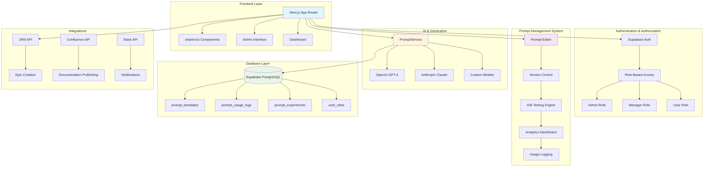

# 🚀 SDLC Automation Platform

[](https://opensource.org/licenses/MIT)
[](https://nextjs.org/)
[](https://www.typescriptlang.org/)
[](https://supabase.com/)
[](https://vercel.com)

> Transform business requirements into comprehensive project documentation with AI-powered automation and enterprise-grade prompt management.

**SDLC Automation Platform** is an open-source platform that automates the creation of software development life cycle documentation using advanced AI models. Generate business analysis, functional specifications, technical documentation, and UX specifications in minutes with a powerful prompt management system.

## 🆕 Recent Updates

- **🧪 Test Specification (TDD/BDD)**: Generate comprehensive test specs following modern TDD & BDD practices
- **📚 Document History Management**: Advanced document history viewer with search, export, and management features
- **🔄 Smart Input Detection**: Modal automatically refreshes for new inputs, preserves docs for same input
- **🎯 Intelligent Document Grouping**: Groups documents by input to reduce redundancy in the UI
- **🤖 AI Coding Prompt**: Generate AI-optimized implementation prompts for coding assistants
- **📥 AI Rules Download**: Download coding rules for Cursor, GitHub Copilot, Windsurf, Claude, and Devin
- **📝 Enhanced Formatting**: Improved markdown rendering with proper bullet point display
- **🔍 Document Search**: Search through generated documents by type, input, or content
- **💾 Persistent History**: Maintains detailed history of all generated documents with timestamps
- **Anonymous User Support**: Generate up to 10 documents without signing up
- **Enhanced Mermaid Viewer**: Improved diagram parsing with preview/raw toggle
- **Simple Landing Page**: Clean, Claude-inspired interface option
- **Mobile Responsive**: Optimized UI for all device sizes

## ✨ Key Features

### 🤖 AI-Powered Document Generation
- **Business Analysis**: Executive summaries, stakeholder analysis, risk assessment
- **Functional Specifications**: User stories, acceptance criteria, use cases
- **Technical Specifications**: System architecture, API design, security implementation
- **UX Specifications**: User personas, journey maps, wireframe descriptions
- **Architecture Diagrams**: Interactive Mermaid diagram generation
- **AI Coding Prompt**: AI-optimized implementation prompts with component specs, data models, and acceptance criteria
- **Test Specification (TDD/BDD)**: Comprehensive test specs with unit tests, BDD scenarios, E2E tests, and performance metrics

### 🧠 Enterprise Prompt Management
- **📝 Advanced Editor**: Syntax highlighting, variable management, template inheritance
- **🔄 Version Control**: Git-like versioning with rollback capabilities
- **🧪 A/B Testing**: Statistical comparison of prompt variations
- **📊 Analytics Dashboard**: Usage statistics, performance monitoring, cost tracking
- **👥 Role-Based Access**: Admin, Manager, and User roles with granular permissions
- **🔍 Testing Interface**: Interactive prompt testing with real-time preview
- **🎯 3-Tier Fallback**: Custom → Database → Hardcoded prompts for 100% reliability

### 🔗 Seamless Integrations
- **Development**: GitHub, Azure DevOps, GitLab
- **Project Management**: JIRA (Epic/Story creation), Linear, Trello
- **Documentation**: Confluence (hierarchical publishing), Notion
- **Communication**: Slack, Microsoft Teams with real-time notifications

### 📋 Document Management
- **History Tracking**: Complete history of all generated documents with inputs and timestamps
- **Smart Grouping**: Intelligent grouping of documents by input to reduce UI clutter
- **Search & Filter**: Search documents by type, input text, or content
- **Bulk Operations**: Export individual documents or clear entire history
- **Input-Aware Generation**: Automatically detects input changes and refreshes generation options

### 🎨 Visual Documentation
- **Interactive Diagrams**: Real-time Mermaid diagram editing and visualization
- **Export Capabilities**: PNG, SVG, PDF with high-resolution output
- **Presentation Mode**: Full-screen viewing and navigation
- **Template Library**: Pre-built diagrams for common architecture patterns

### 🚀 AI Coding Assistant Tools
- **Comprehensive Rules**: Download optimized coding rules with SOLID principles, TDD, and best practices
- **Multi-Tool Support**: Export rules for Cursor, GitHub Copilot, Windsurf, Claude Code, and Devin
- **Format Compatibility**: Automatic formatting for each tool's configuration format
- **Best Practices**: Includes testing strategies, security guidelines, and performance considerations

## 🚀 Quick Start

### Prerequisites

- **Node.js** 18+ 
- **npm/yarn/pnpm**
- **Supabase Account** (free tier available)
- **OpenAI API Key** (for AI generation)

### 1. Clone & Install

```bash
# Clone the repository
git clone https://github.com/your-org/sdlc-automation-platform.git
cd sdlc-automation-platform

# Install dependencies
npm install
```

### 2. Environment Setup

```bash
# Copy environment template
cp .env.example .env.local
```

Configure your `.env.local` file:

```env
# Supabase Configuration
NEXT_PUBLIC_SUPABASE_URL=your_supabase_project_url
NEXT_PUBLIC_SUPABASE_ANON_KEY=your_supabase_anon_key
SUPABASE_SERVICE_ROLE_KEY=your_supabase_service_role_key

# Authentication
NEXTAUTH_SECRET=your_nextauth_secret_key
NEXTAUTH_URL=http://localhost:3000

# AI Configuration
OPENAI_API_KEY=your_openai_api_key

# Admin Setup (Optional - First user becomes admin if not set)
NEXT_PUBLIC_ADMIN_EMAIL=admin@yourcompany.com

# Integration Keys (Optional)
JIRA_API_TOKEN=your_jira_token
CONFLUENCE_API_TOKEN=your_confluence_token
SLACK_BOT_TOKEN=your_slack_token
```

### 3. Database Setup

1. Create a new Supabase project at [supabase.com](https://supabase.com)
2. Go to the SQL Editor in your Supabase dashboard
3. Run the complete setup script:
   ```sql
   -- Copy and run the entire contents of:
   database/schema/initial-setup.sql
   ```
4. (Optional) For anonymous user support, run:
   ```sql
   -- Copy and run the entire contents of:
   database/migrations/consolidated-anonymous-support.sql
   ```
5. (Optional) For Agentic Coding Spec support, run:
   ```sql
   -- Copy and run the entire contents of:
   database/migrations/add-coding-spec.sql
   
   -- Then apply the naming update:
   database/migrations/update-coding-to-ai-prompt.sql
   ```
6. (Optional) For Test Specification support, run:
   ```sql
   -- Copy and run the entire contents of:
   database/migrations/add-test-specification.sql
   ```

#### Manual Setup (Advanced)
If you prefer to run individual migration files, see the [Database Setup Guide](./docs/database-setup.md) for detailed instructions.

### 4. Start Development

```bash
# Start the development server
npm run dev

# Open your browser
open http://localhost:3000
```

### 5. Admin Setup

On first launch:
1. **Sign up** with Google OAuth
2. **First user automatically becomes admin** (if no admin email configured)
3. **Access admin panel** at `/admin/prompts`
4. **Create initial prompts** or import templates

## 📖 Documentation

### 📚 User Guides
- **[Getting Started](./docs/setup/GETTING_STARTED.md)** - Step-by-step walkthrough
- **[Environment Setup](./docs/environment-setup.md)** - Configuration guide
- **[Database Setup](./docs/database-setup.md)** - Database configuration

### 🔧 Technical Documentation
- **[Technical Architecture](./docs/architecture/technical-architecture.md)** - System design overview
- **[API Reference](./docs/api-reference.md)** - REST API documentation
- **[Deployment Guide](./docs/deployment.md)** - Production deployment
- **[Contributing Guide](./CONTRIBUTING.md)** - How to contribute

### 🤝 Community
- **[Code of Conduct](./CODE_OF_CONDUCT.md)** - Community guidelines
- **[Security Policy](./SECURITY.md)** - Security reporting
- **[Changelog](./CHANGELOG.md)** - Version history

## 🏗️ Architecture Overview



## 📋 Feature Highlights

### AI Coding Prompt Generation
Generate comprehensive implementation prompts optimized for AI coding assistants:

```markdown
1. Enter your project description
2. Click "AI Coding Prompt" button
3. Receive detailed prompt including:
   - Project overview and technology stack
   - Component specifications with interfaces
   - Data models with TypeScript definitions
   - API endpoints with request/response schemas
   - Business logic rules and validations
   - Testing requirements and acceptance criteria
   - Implementation sequence and milestones
```

### Test Specification (TDD/BDD)
Generate modern test specifications following Test-Driven Development and Behavior-Driven Development:

```markdown
1. Enter your project description
2. Click "Test Spec" button
3. Receive comprehensive test specification including:
   - Unit test specifications with AAA pattern
   - BDD scenarios in Gherkin syntax
   - Integration testing (API, Database)
   - End-to-end test scenarios
   - Performance testing metrics
   - Security test cases (OWASP Top 10)
   - Accessibility testing (WCAG compliance)
   - Test automation strategy
   - CI/CD integration approach
   - Test data management
   - Risk-based testing priorities
```

Key features:
- **TDD Approach**: Red-Green-Refactor cycle with concrete examples
- **BDD Scenarios**: User stories as executable specifications
- **Modern Tools**: Recommendations for Jest, Cypress, Playwright, etc.
- **Coverage Goals**: Defines metrics and KPIs for quality assurance
- **Automation Ready**: Structured for immediate implementation

### AI Coding Rules Download
Download optimized coding rules for your preferred AI assistant:

| Tool | Config File | Features |
|------|------------|----------|
| **Cursor** | `.cursorrules` | YOLO mode, native IDE integration |
| **GitHub Copilot** | `.github/copilot-instructions.md` | Extension-based, per-request context |
| **Windsurf** | `.windsurf/rules/rules.md` | Cascade Write, auto-memories |
| **Claude Code** | `CLAUDE.md` | Session-based, slash commands |
| **Devin** | `.bashrc` | Full autonomy, VM snapshots |

Each download includes:
- SOLID principles enforcement
- TDD/BDD methodology
- Security best practices
- Performance guidelines
- Documentation standards

## 🛠️ Development

### Project Structure

```
sdlc-automation-platform/
├── app/                    # Next.js App Router
│   ├── api/               # API routes
│   ├── admin/             # Admin interface
│   └── dashboard/         # Main dashboard
├── components/            # React components
│   ├── ui/               # shadcn/ui components
│   └── admin/            # Admin-specific components
├── lib/                  # Utility functions
├── database/             # Database files
│   ├── migrations/       # Database migrations
│   ├── schema/           # Schema definitions
│   └── sample-data/      # Sample data
├── docs/                 # Documentation
│   ├── setup/           # Setup guides
│   ├── architecture/    # Architecture docs
│   ├── api/             # API documentation
│   └── development/     # Development docs
└── scripts/             # Utility scripts
```

### Available Scripts

```bash
# Development
npm run dev              # Start development server
npm run build            # Build for production
npm run start            # Start production server
npm run lint             # Run ESLint
npm run type-check       # Run TypeScript checks

# Database (run in Supabase SQL editor)
# database/schema/initial-setup.sql      # Complete setup
# database/migrations/*.sql              # Individual migrations

# Testing
npm run test             # Run tests
npm run test:watch       # Run tests in watch mode
npm run test:coverage    # Generate coverage report
```

## 🚧 Upcoming Features - Help Wanted!

We're working on two exciting features and need your help! These are perfect opportunities for contributors:

### 🔍 **Advanced Repository Analysis & Digest Generation**
**Goal:** Create comprehensive onboarding digests for any GitHub repository

**What we're building:**
- **Container-based analysis** - Pull repos into isolated containers
- **Multi-tool analysis** - Use various static analysis tools (SonarQube, CodeQL, etc.)
- **AI-powered insights** - Generate detailed functional specifications
- **Technical diagrams** - Auto-generate architecture and flow diagrams
- **Core file identification** - Highlight key files and their purposes
- **Onboarding documentation** - Complete setup and contribution guides

**Tech Stack:** Docker, SonarQube, CodeQL, Mermaid, Claude AI

**Perfect for:** Backend developers, DevOps engineers, AI/ML enthusiasts

---

### 🎨 **Text-to-Wireframe Generation**
**Goal:** Convert detailed specifications into visual wireframes

**What we're building:**
- **Spec-to-wireframe conversion** - Transform functional specs into UI mockups
- **Mermaid integration** - Generate wireframe diagrams using Mermaid
- **v0.dev integration** - Leverage v0.dev for modern UI generation
- **Interactive previews** - Real-time wireframe visualization
- **Export capabilities** - PNG, SVG, and interactive formats

**Tech Stack:** Mermaid.js, v0.dev API, React, Canvas API

**Perfect for:** Frontend developers, UI/UX designers, React enthusiasts

---

### 🎯 **How to Get Started**
1. **Check existing issues** - Look for issues labeled `good first issue`
2. **Join discussions** - Comment on the feature issues below
3. **Pick a task** - Choose what interests you most
4. **Submit a PR** - We'll guide you through the process

**Ready to contribute?** Check out these issues:
- [#XX] Advanced Repository Analysis & Digest Generation
- [#XX] Text-to-Wireframe Generation

---

## 🤝 Contributing

We welcome contributions! Please see our [Contributing Guide](./CONTRIBUTING.md) for details.

### Development Setup

1. Fork the repository
2. Create a feature branch
3. Make your changes
4. Add tests if applicable
5. Submit a pull request

### Code Style

- Use TypeScript for all new code
- Follow ESLint configuration
- Use meaningful variable and function names
- Add JSDoc comments for complex functions

## 📄 License

This project is licensed under the MIT License - see the [LICENSE](./LICENSE) file for details.

## 🆘 Support

- **Documentation**: Check our [docs](./docs/) directory
- **Issues**: Report bugs and request features on [GitHub Issues](https://github.com/your-org/sdlc-automation-platform/issues)
- **Discussions**: Join our [GitHub Discussions](https://github.com/your-org/sdlc-automation-platform/discussions)
- **Security**: Report security issues to [security@yourdomain.com](mailto:security@yourdomain.com)

## 🙏 Acknowledgments

- [Next.js](https://nextjs.org/) for the amazing React framework
- [Supabase](https://supabase.com/) for the backend-as-a-service
- [shadcn/ui](https://ui.shadcn.com/) for the beautiful UI components
- [OpenAI](https://openai.com/) and [Anthropic](https://anthropic.com/) for AI capabilities
- All our contributors and the open source community

---

**Made with ❤️ by the SDLC Automation Platform team**
