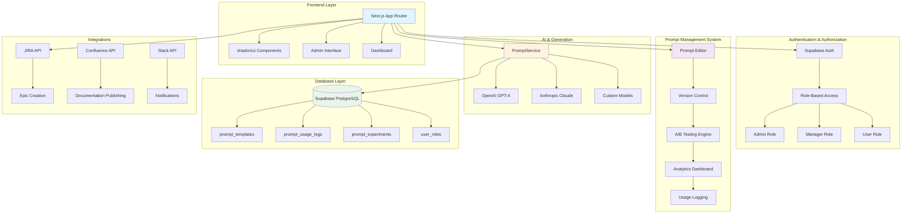

# 🚀 SDLC AI - Open Source AI-Powered Documentation Platform

[](https://opensource.org/licenses/MIT)
[](https://nextjs.org/)
[](https://www.typescriptlang.org/)
[](https://supabase.com/)
[](https://vercel.com)

> Transform business requirements into comprehensive project documentation with AI-powered automation and enterprise-grade prompt management.

**SDLC AI** is an open-source platform that automates the creation of software development life cycle documentation using advanced AI models. Generate business analysis, functional specifications, technical documentation, and UX specifications in minutes with a powerful prompt management system.

## ✨ Key Features

### 🤖 AI-Powered Document Generation
- **Business Analysis**: Executive summaries, stakeholder analysis, risk assessment
- **Functional Specifications**: User stories, acceptance criteria, use cases
- **Technical Specifications**: System architecture, API design, security implementation
- **UX Specifications**: User personas, journey maps, wireframe descriptions
- **Architecture Diagrams**: Interactive Mermaid diagram generation

### 🧠 Enterprise Prompt Management
- **📝 Advanced Editor**: Syntax highlighting, variable management, template inheritance
- **🔄 Version Control**: Git-like versioning with rollback capabilities
- **🧪 A/B Testing**: Statistical comparison of prompt variations
- **📊 Analytics Dashboard**: Usage statistics, performance monitoring, cost tracking
- **👥 Role-Based Access**: Admin, Manager, and User roles with granular permissions
- **🔍 Testing Interface**: Interactive prompt testing with real-time preview
- **🎯 3-Tier Fallback**: Custom → Database → Hardcoded prompts for 100% reliability

### 🔗 Seamless Integrations
- **Development**: GitHub, Azure DevOps, GitLab
- **Project Management**: JIRA (Epic/Story creation), Linear, Trello
- **Documentation**: Confluence (hierarchical publishing), Notion
- **Communication**: Slack, Microsoft Teams with real-time notifications

### 🎨 Visual Documentation
- **Interactive Diagrams**: Real-time Mermaid diagram editing and visualization
- **Export Capabilities**: PNG, SVG, PDF with high-resolution output
- **Presentation Mode**: Full-screen viewing and navigation
- **Template Library**: Pre-built diagrams for common architecture patterns

## 🚀 Quick Start

### Prerequisites

- **Node.js** 18+ 
- **npm/yarn/pnpm**
- **Supabase Account** (free tier available)
- **OpenAI API Key** (for AI generation)

### 1. Clone & Install

```bash
# Clone the repository
git clone https://github.com/your-org/sdlc-ai.git
cd sdlc-ai

# Install dependencies
npm install
```

### 2. Environment Setup

```bash
# Copy environment template
cp .env.example .env.local
```

Configure your `.env.local` file:

```env
# Supabase Configuration
NEXT_PUBLIC_SUPABASE_URL=your_supabase_project_url
NEXT_PUBLIC_SUPABASE_ANON_KEY=your_supabase_anon_key
SUPABASE_SERVICE_ROLE_KEY=your_supabase_service_role_key

# Authentication
NEXTAUTH_SECRET=your_nextauth_secret_key
NEXTAUTH_URL=http://localhost:3000

# AI Configuration
OPENAI_API_KEY=your_openai_api_key

# Admin Setup (Optional - First user becomes admin if not set)
NEXT_PUBLIC_ADMIN_EMAIL=admin@yourcompany.com

# Integration Keys (Optional)
JIRA_API_TOKEN=your_jira_token
CONFLUENCE_API_TOKEN=your_confluence_token
SLACK_BOT_TOKEN=your_slack_token
```

### 3. Database Setup

#### Option A: Automatic Setup (Recommended)
```bash
# Run the setup script
npm run setup:database
```

#### Option B: Manual Setup
1. Create a new Supabase project at [supabase.com](https://supabase.com)
2. Go to the SQL Editor in your Supabase dashboard
3. Run the following scripts in order:
   - `scripts/setup-database.sql` (Core tables)
   - `scripts/prompt-management-migration.sql` (Prompt management)

### 4. Start Development

```bash
# Start the development server
npm run dev

# Open your browser
open http://localhost:3000
```

### 5. Admin Setup

On first launch:
1. **Sign up** with Google OAuth
2. **First user automatically becomes admin** (if no admin email configured)
3. **Access admin panel** at `/admin/prompts`
4. **Create initial prompts** or import templates

## 📖 Documentation

### 📚 User Guides
- **[Prompt Management Guide](http://localhost:3000/admin/prompts/guide)** - Complete system guide
- **[Getting Started Tutorial](./docs/getting-started.md)** - Step-by-step walkthrough
- **[Best Practices](./docs/best-practices.md)** - Prompt engineering tips

### 🔧 Technical Documentation
- **[Technical Architecture](./docs/technical-architecture.md)** - System design overview
- **[Database Schema](./docs/database-setup.md)** - Complete database documentation
- **[API Reference](./docs/api-reference.md)** - REST API documentation
- **[Deployment Guide](./docs/deployment.md)** - Production deployment

### 🤝 Community
- **[Contributing Guide](./docs/contributing.md)** - How to contribute
- **[Code of Conduct](./CODE_OF_CONDUCT.md)** - Community guidelines
- **[Security Policy](./SECURITY.md)** - Security reporting

## 🏗️ Architecture Overview



## 🛠️ Tech Stack

### Frontend
- **Framework**: Next.js 15 with App Router
- **UI Library**: shadcn/ui + Tailwind CSS
- **Components**: Radix UI primitives
- **Language**: TypeScript
- **State Management**: React Context + Hooks

### Backend
- **Database**: Supabase (PostgreSQL)
- **Authentication**: Supabase Auth with Google OAuth
- **API**: Next.js API Routes
- **ORM**: Supabase Client with TypeScript

### AI & Integrations
- **AI Models**: OpenAI GPT-4, Anthropic Claude
- **Diagrams**: Mermaid.js
- **Integrations**: JIRA, Confluence, Slack APIs

### Deployment
- **Platform**: Vercel (recommended)
- **CDN**: Global edge deployment
- **Database**: Supabase cloud
- **Monitoring**: Built-in analytics

## 🎯 Usage Examples

### Generate Complete Documentation

```typescript
// Example: E-commerce platform requirements
const projectInput = `
We need to build an e-commerce platform with:
- User authentication and profiles
- Product catalog with search and filtering
- Shopping cart and checkout process
- Payment integration (Stripe)
- Order management and tracking
- Admin dashboard for inventory management
- Mobile-responsive design
- SEO optimization
`;

// System generates:
// ✅ Business Analysis (market research, stakeholder analysis)
// ✅ Functional Specifications (user stories, acceptance criteria)
// ✅ Technical Architecture (system design, API specs)
// ✅ UX Specifications (user journeys, wireframes)
// ✅ Implementation Roadmap (milestones, dependencies)
```

### Custom Prompt Creation

```typescript
// Create organization-specific prompts
const customBusinessAnalysisPrompt = `
Analyze the following requirement with emphasis on:

**Business Context:**
- Market opportunity and competitive landscape
- Revenue impact and business metrics
- Stakeholder analysis and communication plan

**Risk Assessment:**
- Technical risks and mitigation strategies
- Resource requirements and timeline
- Compliance and security considerations

**Success Criteria:**
- Key performance indicators (KPIs)
- User acceptance criteria
- Business value measurement

Requirement: {{project_description}}
Industry: {{industry}}
Timeline: {{timeline}}
`;
```

### Integration Workflow

```typescript
// Automated JIRA integration
const jiraWorkflow = {
  epic: "E-commerce Platform Development",
  stories: [
    "As a customer, I want to browse products so I can find items to purchase",
    "As a customer, I want to add items to cart so I can purchase multiple products",
    "As an admin, I want to manage inventory so I can track stock levels"
  ],
  tasks: [
    "Set up database schema for products and users",
    "Implement user authentication with OAuth",
    "Create responsive product catalog interface"
  ]
};
```

## 🔧 Configuration

### AI Model Configuration

```env
# Primary AI provider
OPENAI_API_KEY=sk-...
OPENAI_MODEL=gpt-4

# Secondary provider (optional)
ANTHROPIC_API_KEY=sk-ant-...
ANTHROPIC_MODEL=claude-3-sonnet
```

### Integration Setup

#### JIRA Integration
1. Generate API token in JIRA settings
2. Add to environment variables
3. Configure project keys in admin panel

#### Confluence Integration
1. Create API token in Atlassian account
2. Configure space keys and permissions
3. Test connection in integration hub

#### Slack Integration
1. Create Slack app with bot permissions
2. Install to workspace
3. Configure notification channels

## 📊 Prompt Management Features

### Role-Based Access Control

| Role | Permissions | Access Level |
|------|-------------|--------------|
| **Admin** | Full system access, user management, prompt deployment | 🔴 Full |
| **Manager** | Prompt viewing, testing, analytics access | 🟡 Limited |
| **User** | API usage only, no admin interface | 🟢 Basic |

### Analytics & Monitoring

- **📈 Usage Metrics**: Request volume, success rates, response times
- **💰 Cost Tracking**: Token usage and API costs per prompt
- **🔍 Error Analysis**: Detailed error logs with resolution suggestions
- **👥 User Analytics**: Individual and team usage patterns

### A/B Testing Framework

```typescript
// Example A/B test configuration
const promptExperiment = {
  name: "Business Analysis Optimization",
  variants: {
    control: "Original business analysis prompt",
    variant_a: "Enhanced with market research focus",
    variant_b: "Streamlined for startup use cases"
  },
  trafficSplit: { control: 34, variant_a: 33, variant_b: 33 },
  successMetrics: ["response_time", "user_satisfaction", "completion_rate"]
};
```

## 🚀 Deployment

### Vercel Deployment (Recommended)

[](https://vercel.com/new/clone?repository-url=https://github.com/your-org/sdlc-ai)

1. **Connect Repository**: Import from GitHub
2. **Configure Environment**: Add all required environment variables
3. **Deploy**: Automatic deployment with optimized settings

### Docker Deployment

```bash
# Build the container
docker build -t sdlc-ai .

# Run with environment file
docker run -p 3000:3000 --env-file .env.local sdlc-ai
```

### Manual Deployment

```bash
# Build for production
npm run build

# Start production server
npm run start
```

## 🤝 Contributing

We welcome contributions! Here's how to get started:

### Development Setup

```bash
# Fork and clone the repository
git clone https://github.com/your-username/sdlc-ai.git
cd sdlc-ai

# Create a feature branch
git checkout -b feature/amazing-feature

# Install dependencies
npm install

# Start development server
npm run dev
```

### Contribution Guidelines

1. **🔍 Check existing issues** before creating new ones
2. **📝 Write clear commit messages** following conventional commits
3. **🧪 Add tests** for new features when applicable
4. **📚 Update documentation** for user-facing changes
5. **🎨 Follow code style** (ESLint + Prettier)

### Code Style

```bash
# Run linting
npm run lint

# Fix formatting
npm run format

# Type checking
npm run type-check
```

## 📈 Roadmap

### ✅ Completed (Phase 1-4)
- **Core SDLC Generation**: All document types with AI-powered content
- **Prompt Management System**: Full-featured with version control, A/B testing, analytics
- **Role-Based Access Control**: Admin, Manager, User roles with proper permissions
- **Integration Hub**: JIRA, Confluence, Slack integrations
- **Visual Documentation**: Interactive Mermaid diagrams with export capabilities

### 🔄 In Progress (Phase 5)
- **Advanced AI Models**: Claude 3, Gemini Pro integration
- **Performance Optimization**: Caching layers and response time improvements
- **Mobile Experience**: Responsive design and mobile-specific features
- **API Enhancements**: Rate limiting, webhook support, batch operations

### 📋 Planned (Phase 6+)
- **Plugin System**: Extensible architecture for custom integrations
- **Multi-language Support**: Internationalization and localization
- **Advanced Analytics**: Predictive analytics and trend analysis
- **Enterprise Features**: SSO, audit logging, compliance reporting

## 💡 Use Cases

### For Startups
- **Rapid MVP Documentation**: Document features quickly for investor presentations
- **Technical Specifications**: Clear architecture for development teams
- **User Stories**: Product requirements for agile development

### For Enterprises
- **Standardized Documentation**: Consistent templates across all projects
- **Compliance Documentation**: Audit trails and approval workflows
- **Cross-team Collaboration**: Shared templates and best practices

### For Consultants
- **Client Deliverables**: Professional documentation for client projects
- **Proposal Generation**: Quick technical proposals and estimates
- **Knowledge Management**: Reusable templates and case studies

## 🔒 Security

### Data Protection
- **🔐 Encryption**: All data encrypted in transit and at rest
- **🛡️ API Security**: Rate limiting, authentication, and authorization
- **🔍 Audit Logging**: Complete activity tracking for compliance
- **🚨 Vulnerability Scanning**: Regular security assessments

### Privacy
- **📋 GDPR Compliant**: Right to deletion and data portability
- **🔒 Data Minimization**: Only collect necessary information
- **🌍 Data Residency**: Control where your data is stored
- **📊 Transparency**: Clear data usage policies

## 📞 Support & Community

### 🆘 Getting Help
- **📖 Documentation**: Comprehensive guides at `/admin/prompts/guide`
- **💬 GitHub Discussions**: Community Q&A and feature requests
- **🐛 Issue Tracker**: Bug reports and feature requests
- **📧 Email Support**: Direct support for urgent issues

### 🌍 Community
- **🤝 Discord Server**: Real-time community chat
- **📱 Twitter**: Follow [@SDLCai](https://twitter.com/sdlcai) for updates
- **📺 YouTube**: Tutorials and feature demonstrations
- **📝 Blog**: Best practices and case studies

### 💼 Enterprise Support
- **📞 Priority Support**: Dedicated support channels
- **🎯 Custom Training**: Team onboarding and training sessions
- **🔧 Custom Development**: Tailored features and integrations
- **📊 Success Management**: Dedicated customer success manager

## 📄 License

This project is licensed under the MIT License - see the [LICENSE](LICENSE) file for details.

## 🙏 Acknowledgments

- **OpenAI** for GPT-4 API and AI capabilities
- **Anthropic** for Claude AI integration
- **Supabase** for database and authentication infrastructure
- **Vercel** for deployment platform and edge functions
- **shadcn/ui** for beautiful UI components
- **Mermaid** for diagram generation capabilities

## ⭐ Star History

If you find this project helpful, please consider giving it a star! ⭐

[](https://star-history.com/#your-org/sdlc-ai&Date)

---

**Made with ❤️ by the SDLC AI community**

*Transform your documentation workflow today with the power of AI and open source collaboration.*

---

### 📊 Project Statistics

- **🏗️ Architecture**: Modern Next.js 15 with TypeScript
- **🧠 AI Integration**: Multi-model support (GPT-4, Claude)
- **📦 Database**: PostgreSQL with Supabase
- **🎨 UI Components**: 25+ custom components
- **🔌 Integrations**: 5+ platform integrations
- **👥 Role System**: 3-tier permission model
- **📈 Analytics**: Real-time usage tracking
- **🧪 Testing**: A/B testing framework
- **🔄 Version Control**: Git-like prompt versioning

**Ready to revolutionize your documentation workflow? [Get started now!](#-quick-start)**
