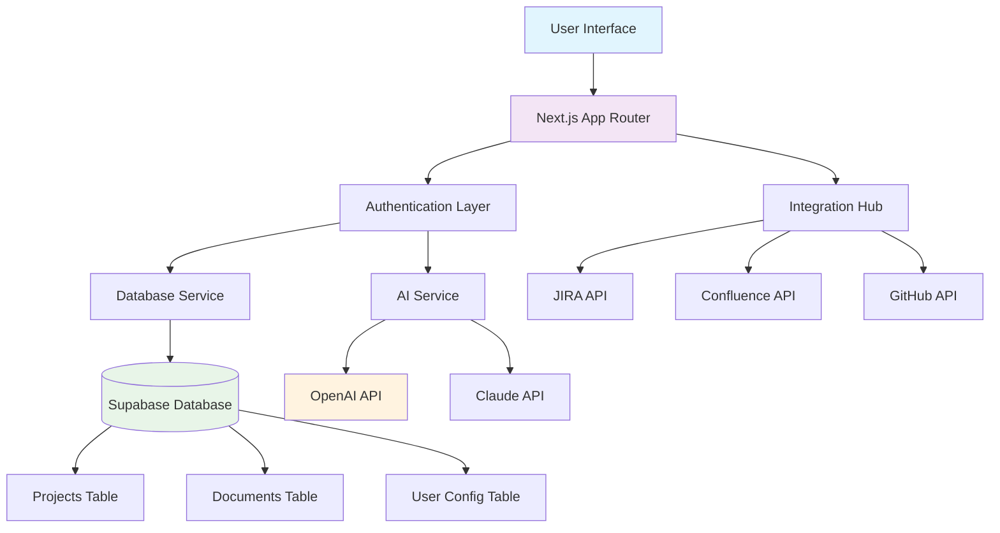

# 🚀 SDLC AI - Open Source AI-Powered Software Development Life Cycle Automation

[](https://opensource.org/licenses/MIT)
[](https://nextjs.org/)
[](https://www.typescriptlang.org/)
[](https://supabase.com/)

Transform your business requirements into comprehensive project documentation with AI-powered automation. Generate business analysis, functional specifications, technical documentation, and UX specifications in minutes, not days.

## 📖 Overview

SDLC AI is an open-source platform that automates the creation of software development life cycle documentation using advanced AI models. It streamlines the entire process from business case analysis to technical implementation specifications.

### 🎯 Key Features

- **🤖 AI-Powered Generation**: Leverage GPT-4, Claude, and other AI models
- **📋 Complete SDLC Coverage**: Business analysis, functional specs, technical docs, UX specs
- **🔗 Integration Ready**: JIRA, Confluence, GitHub, Slack integrations
- **🎨 Visual Diagrams**: Automated Mermaid diagram generation
- **🔧 Customizable Templates**: Prompt engineering interface for custom workflows
- **🔒 Secure & Scalable**: Built with modern security practices and scalable architecture

## 🚀 Quick Start

### Prerequisites

- Node.js 18+ 
- npm/yarn/pnpm
- Supabase account (free tier available)
- OpenAI API key

### Installation

1. **Clone the repository**
   ```bash
   git clone https://github.com/your-username/sdlc-ai.git
   cd sdlc-ai
   ```

2. **Install dependencies**
   ```bash
   npm install
   ```

3. **Set up environment variables**
   ```bash
   cp .env.example .env.local
   ```
   
   Fill in your environment variables:
   ```env
   NEXT_PUBLIC_SUPABASE_URL=your_supabase_url
   NEXT_PUBLIC_SUPABASE_ANON_KEY=your_supabase_anon_key
   SUPABASE_SERVICE_ROLE_KEY=your_service_role_key
   NEXTAUTH_SECRET=your_nextauth_secret
   NEXTAUTH_URL=http://localhost:3000
   ```

4. **Set up the database**
   - Run the SQL script in `scripts/setup-database.sql` in your Supabase SQL editor
   - See [Database Setup Guide](./docs/database-setup.md) for detailed instructions

5. **Run the development server**
   ```bash
   npm run dev
   ```

6. **Open your browser**
   Navigate to [http://localhost:3000](http://localhost:3000)

## 📚 Documentation

- **[Product Overview](./PRODUCT_SHEET.md)** - Comprehensive product features and capabilities
- **[Technical Architecture](./docs/technical-architecture.md)** - System design and architecture diagrams
- **[Database Setup](./docs/database-setup.md)** - Database schema and setup instructions
- **[API Documentation](./docs/api-reference.md)** - API endpoints and integration guides
- **[Deployment Guide](./docs/deployment.md)** - Production deployment instructions
- **[Contributing Guide](./docs/contributing.md)** - How to contribute to the project

## 🏗️ Architecture



## 🛠️ Tech Stack

- **Frontend**: Next.js 15, React 18, TypeScript
- **UI**: Tailwind CSS, shadcn/ui, Radix UI
- **Database**: Supabase (PostgreSQL)
- **Authentication**: Supabase Auth with Google OAuth
- **AI Integration**: OpenAI GPT-4, Anthropic Claude
- **Deployment**: Vercel
- **Development**: ESLint, Prettier, Husky

## 🔧 Configuration

### AI Models
Configure your preferred AI models in the dashboard:
- OpenAI GPT-4 (recommended)
- OpenAI GPT-3.5 Turbo
- Anthropic Claude 3

### Integrations
Connect your development tools:
- **JIRA**: Epic and story creation
- **Confluence**: Documentation publishing
- **GitHub**: Repository integration
- **Slack**: Team notifications

## 📊 Usage Examples

### Generate Complete SDLC Documentation

```typescript
// Example: Generate documentation for a new feature
const projectInput = `
We need to implement a user authentication system that supports:
- Email/password login
- Google OAuth integration
- Password reset functionality
- Role-based access control
- Session management
`;

// The system will generate:
// 1. Business Analysis Document
// 2. Functional Specifications
// 3. Technical Architecture
// 4. UX/UI Specifications
// 5. Implementation Roadmap
```

### Custom Template Creation

```typescript
// Create custom prompts for your organization
const customPrompt = {
  businessAnalysis: `
    Analyze the following requirement with focus on:
    - ROI and business impact
    - Stakeholder analysis
    - Risk assessment
    - Success metrics
  `,
  technicalSpec: `
    Create technical specifications including:
    - System architecture
    - API design
    - Security considerations
    - Performance requirements
  `
};
```

## 🤝 Contributing

We welcome contributions! Please see our [Contributing Guide](./docs/contributing.md) for details.

### Development Workflow

1. Fork the repository
2. Create a feature branch (`git checkout -b feature/amazing-feature`)
3. Make your changes
4. Add tests if applicable
5. Commit your changes (`git commit -m 'Add amazing feature'`)
6. Push to the branch (`git push origin feature/amazing-feature`)
7. Open a Pull Request

### Code Style

- Use TypeScript for all new code
- Follow the existing code style (ESLint + Prettier)
- Write meaningful commit messages
- Add documentation for new features

## 📈 Roadmap

- [ ] **Multi-language Support** - Support for multiple programming languages
- [ ] **Advanced AI Models** - Integration with more AI providers
- [ ] **Real-time Collaboration** - Live editing and collaboration features
- [ ] **Mobile App** - React Native mobile application
- [ ] **API Marketplace** - Third-party integration marketplace
- [ ] **Enterprise Features** - SSO, advanced security, audit logs

## 🐛 Issues & Support

- **Bug Reports**: [GitHub Issues](https://github.com/your-username/sdlc-ai/issues)
- **Feature Requests**: [GitHub Discussions](https://github.com/your-username/sdlc-ai/discussions)
- **Documentation**: [Wiki](https://github.com/your-username/sdlc-ai/wiki)

## 📄 License

This project is licensed under the MIT License - see the [LICENSE](LICENSE) file for details.

## 🙏 Acknowledgments

- [OpenAI](https://openai.com/) for GPT models
- [Anthropic](https://anthropic.com/) for Claude AI
- [Supabase](https://supabase.com/) for backend infrastructure
- [Vercel](https://vercel.com/) for deployment platform
- [shadcn/ui](https://ui.shadcn.com/) for UI components

## 🌟 Star History

If you find this project useful, please consider giving it a star! ⭐

---

**Made with ❤️ by the SDLC AI community**
