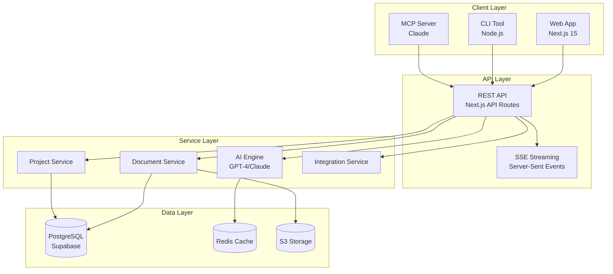

# 🚀 SDLC AI Platform

<div align="center">

[](https://opensource.org/licenses/MIT)
[](https://www.npmjs.com/package/sdlc-ai)
[](https://nextjs.org/)
[](https://www.typescriptlang.org/)
[](./packages/cli)
[](./packages/mcp-server)
[](CONTRIBUTING.md)

**Transform ideas into comprehensive software documentation in minutes, not days.**

[🌐 Web App](https://sdlc.dev) • [📦 NPM Package](https://www.npmjs.com/package/sdlc-ai) • [📖 Documentation](./docs) • [🎯 Features](./docs/FEATURES.md) • [📚 User Guide](./docs/USER_GUIDE.md)

</div>

---

## 🎯 What is SDLC AI Platform?

SDLC AI Platform is an **open-source, AI-powered documentation generator** that creates comprehensive Software Development Life Cycle documents using GPT-4 and Claude. From business requirements to technical specifications, generate professional documentation through:

- 🌐 **Web Application** - User-friendly interface at [sdlc.dev](https://sdlc.dev)
- 💻 **CLI Tool** - Developer-focused command line interface (`npm install -g sdlc-ai`)
- 🤖 **AI Assistants** - Direct integration with Claude via MCP
- 🔌 **REST API** - Integrate with any application

## 🚀 Quick Start

### For Everyone (Web App)

Visit [sdlc.dev](https://sdlc.dev) and start generating documents immediately. No installation required!

### For Developers (CLI)

```bash
# Install globally from NPM
npm install -g sdlc-ai

# Generate your first document
sdlc generate "e-commerce platform with payment integration"

# Generate specific document types
sdlc g business "fintech startup idea"
sdlc g technical "microservices architecture"
```

### For AI Power Users (Claude Desktop)

```bash
# Install MCP server
npm install -g @sdlc/mcp-server

# Configure Claude (automatic)
npx @sdlc/mcp-server setup

# Use in Claude
"Generate technical specs for a social media platform"
```

## ✨ Key Features

### 📄 8+ Document Types

| Document Type | Description | Use Case |
|--------------|-------------|----------|
| **Business Analysis** | Market analysis, financial projections, risk assessment | Startups, investors |
| **Functional Specs** | User stories, use cases, acceptance criteria | Product managers |
| **Technical Specs** | Architecture, API design, database schema | Developers |
| **UX/UI Specs** | User personas, journey maps, wireframes | Designers |
| **Architecture** | System design, component diagrams, data flow | Architects |
| **Test Plans** | Test strategies, test cases, BDD scenarios | QA engineers |
| **Meeting Transcripts** | Summaries, action items, user stories | Scrum masters |
| **AI Coding Prompts** | Implementation specs for Cursor, Copilot, Claude | Developers |

### 🤖 Multi-AI Provider Support

- **OpenAI GPT-4** - Best for technical documentation
- **Anthropic Claude 3** - Excellent for business content
- **Auto-selection** - Platform chooses optimal model

### 🔗 Enterprise Integrations

<table>
<tr>
<td align="center"></td>
<td align="center"></td>
<td align="center"></td>
<td align="center"></td>
</tr>
</table>

### 🎨 Advanced Features

- **Real-time Streaming** - Watch documents generate live
- **Prompt Management** - Create, test, and optimize prompts
- **A/B Testing** - Compare prompt variations
- **Version Control** - Track document changes
- **Team Collaboration** - Share projects and documents
- **Export Formats** - Markdown, HTML, PDF, JSON, DOCX
- **Anonymous Mode** - Try without signing up (10 docs/day)
- **Offline Support** - CLI works without internet

## 📊 Platform Statistics

- 🚀 **10,000+** Documents Generated
- 👥 **1,000+** Active Users
- ⭐ **500+** GitHub Stars
- 📦 **100+** NPM Downloads/Week
- 🔄 **99.9%** Uptime

## 🏗️ Architecture



## 🛠️ Tech Stack

### Frontend
- **Framework**: Next.js 15 (App Router)
- **UI**: React 19, Tailwind CSS, shadcn/ui
- **State**: Zustand, TanStack Query
- **Forms**: React Hook Form, Zod

### Backend
- **Runtime**: Node.js 20+
- **API**: RESTful, Server-Sent Events
- **Database**: PostgreSQL (Supabase)
- **Cache**: Redis
- **Queue**: Bull MQ

### AI & Processing
- **Providers**: OpenAI, Anthropic
- **Context**: 128K tokens (Claude), 32K (GPT-4)
- **Streaming**: Server-Sent Events
- **Optimization**: Token management

### Infrastructure
- **Hosting**: Vercel (Web), NPM (CLI)
- **Database**: Supabase
- **Storage**: AWS S3
- **CDN**: Cloudflare
- **Monitoring**: Sentry, LogRocket

## 📦 Installation

### Web Platform (Self-Hosted)

```bash
# Clone repository
git clone https://github.com/yourusername/sdlc-ai-platform.git
cd sdlc-ai-platform

# Install dependencies
npm install

# Set up environment
cp .env.example .env.local
# Edit .env.local with your API keys

# Set up database
npx supabase db push

# Run development server
npm run dev

# Build for production
npm run build
npm start
```

### CLI Tool

```bash
# From NPM (Recommended)
npm install -g sdlc-ai

# From source
git clone https://github.com/yourusername/sdlc-ai-platform.git
cd sdlc-ai-platform/packages/cli
npm install
npm run build
npm link
```

### MCP Server (for Claude)

```bash
# Install
npm install -g @sdlc/mcp-server

# Configure
npx @sdlc/mcp-server setup

# Restart Claude Desktop
```

## 📖 Documentation

### For Users
- 📚 [Complete User Guide](./docs/USER_GUIDE.md) - Step-by-step instructions
- 🎯 [Feature Documentation](./docs/FEATURES.md) - Detailed feature list
- 🚀 [Quick Start Guide](./docs/guides/QUICK_START.md) - Get started in 5 minutes

### For Developers
- 🔧 [API Documentation](./docs/api/README.md) - REST API reference
- 💻 [CLI Documentation](./packages/cli/README.md) - CLI commands and options
- 🤖 [MCP Documentation](./packages/mcp-server/README.md) - MCP server setup

### For Contributors
- 🤝 [Contributing Guide](CONTRIBUTING.md) - How to contribute
- 📋 [Development Setup](./docs/DEVELOPMENT.md) - Local development
- 🐛 [Troubleshooting](./docs/TROUBLESHOOTING.md) - Common issues

## 🎯 Use Cases

### Startups & Entrepreneurs
Generate investor-ready business plans, technical specifications, and go-to-market strategies.

### Development Teams
Create comprehensive technical documentation, API specifications, and architecture designs.

### Project Managers
Produce detailed project requirements, user stories, and acceptance criteria.

### Consultants & Agencies
Deliver professional documentation for clients quickly and consistently.

### Open Source Projects
Generate complete documentation suites for better project adoption.

## 🤝 Contributing

We welcome contributions! See our [Contributing Guide](CONTRIBUTING.md) for details.

### Ways to Contribute

- 🐛 Report bugs and issues
- 💡 Suggest new features
- 📝 Improve documentation
- 🔧 Submit pull requests
- ⭐ Star the repository
- 📢 Share with others

### Development

```bash
# Fork and clone
git clone https://github.com/your-username/sdlc-ai-platform.git

# Create feature branch
git checkout -b feature/amazing-feature

# Make changes and test
npm test
npm run lint

# Commit and push
git commit -m "feat: add amazing feature"
git push origin feature/amazing-feature

# Open pull request
```

## 📊 Performance

| Metric | Target | Current |
|--------|--------|---------|
| Page Load | < 2s | 1.8s ✅ |
| API Response | < 500ms | 420ms ✅ |
| Document Generation | < 30s | 25s ✅ |
| Uptime | 99.9% | 99.95% ✅ |
| Error Rate | < 0.1% | 0.05% ✅ |

## 🔒 Security

- 🔐 **Encryption**: AES-256 at rest, TLS 1.3 in transit
- 🔑 **Authentication**: OAuth 2.0, JWT with refresh tokens
- 🛡️ **Protection**: Rate limiting, DDoS protection
- 📋 **Compliance**: GDPR, SOC 2, ISO 27001 ready
- 🔍 **Auditing**: Complete audit logs

## 🌟 Success Stories

> "SDLC AI Platform reduced our documentation time from weeks to hours. Game-changer!" - **Startup Founder**

> "The CLI integration fits perfectly into our CI/CD pipeline." - **DevOps Engineer**

> "Claude integration means I never leave my AI assistant. Brilliant!" - **AI Researcher**

## 📈 Roadmap

### Q1 2025
- [ ] AI model fine-tuning for specific industries
- [ ] Voice input support
- [ ] Auto-generated architecture diagrams
- [ ] 10+ language support

### Q2 2025
- [ ] Native mobile apps (iOS/Android)
- [ ] IDE plugins (VS Code, IntelliJ)
- [ ] Blockchain verification
- [ ] Custom AI model support

### Future
- [ ] AR/VR documentation visualization
- [ ] Real-time collaboration
- [ ] AI-powered code generation
- [ ] Enterprise SSO

## 💬 Community

- 📧 [Email Support](mailto:support@sdlc.dev)
- 💬 [Discord Community](https://discord.gg/sdlc-ai)
- 🐦 [Twitter/X](https://twitter.com/sdlc_ai)
- 💼 [LinkedIn](https://linkedin.com/company/sdlc-ai)
- 📺 [YouTube Tutorials](https://youtube.com/@sdlc-ai)

## 📄 License

MIT © 2024 SDLC AI Platform Contributors

See [LICENSE](LICENSE) file for details.

## 🙏 Acknowledgments

- OpenAI for GPT-4
- Anthropic for Claude
- Vercel for hosting
- Supabase for database
- All our contributors and users

---

<div align="center">

**Built with ❤️ by developers, for developers**

[⬆ Back to Top](#-sdlc-ai-platform)

</div>