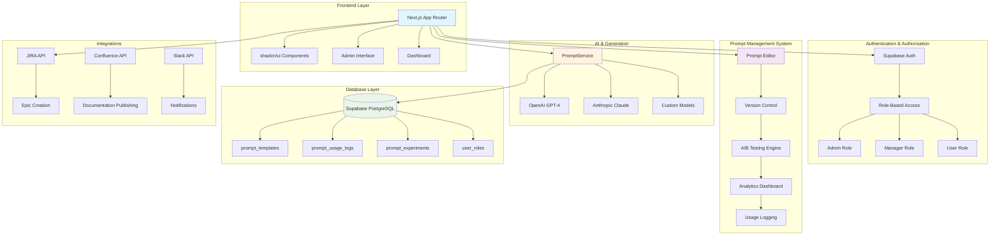

# 🚀 SDLC Automation Platform

[](https://opensource.org/licenses/MIT)
[](https://nextjs.org/)
[](https://www.typescriptlang.org/)
[](https://supabase.com/)
[](https://vercel.com)

> Transform business requirements into comprehensive project documentation with AI-powered automation and enterprise-grade prompt management.

**SDLC Automation Platform** is an open-source platform that automates the creation of software development life cycle documentation using advanced AI models. Generate business analysis, functional specifications, technical documentation, and UX specifications in minutes with a powerful prompt management system.

## ✨ Key Features

### 🤖 AI-Powered Document Generation
- **Business Analysis**: Executive summaries, stakeholder analysis, risk assessment
- **Functional Specifications**: User stories, acceptance criteria, use cases
- **Technical Specifications**: System architecture, API design, security implementation
- **UX Specifications**: User personas, journey maps, wireframe descriptions
- **Architecture Diagrams**: Interactive Mermaid diagram generation

### 🧠 Enterprise Prompt Management
- **📝 Advanced Editor**: Syntax highlighting, variable management, template inheritance
- **🔄 Version Control**: Git-like versioning with rollback capabilities
- **🧪 A/B Testing**: Statistical comparison of prompt variations
- **📊 Analytics Dashboard**: Usage statistics, performance monitoring, cost tracking
- **👥 Role-Based Access**: Admin, Manager, and User roles with granular permissions
- **🔍 Testing Interface**: Interactive prompt testing with real-time preview
- **🎯 3-Tier Fallback**: Custom → Database → Hardcoded prompts for 100% reliability

### 🔗 Seamless Integrations
- **Development**: GitHub, Azure DevOps, GitLab
- **Project Management**: JIRA (Epic/Story creation), Linear, Trello
- **Documentation**: Confluence (hierarchical publishing), Notion
- **Communication**: Slack, Microsoft Teams with real-time notifications

### 🎨 Visual Documentation
- **Interactive Diagrams**: Real-time Mermaid diagram editing and visualization
- **Export Capabilities**: PNG, SVG, PDF with high-resolution output
- **Presentation Mode**: Full-screen viewing and navigation
- **Template Library**: Pre-built diagrams for common architecture patterns

## 🚀 Quick Start

### Prerequisites

- **Node.js** 18+ 
- **npm/yarn/pnpm**
- **Supabase Account** (free tier available)
- **OpenAI API Key** (for AI generation)

### 1. Clone & Install

```bash
# Clone the repository
git clone https://github.com/your-org/sdlc-automation-platform.git
cd sdlc-automation-platform

# Install dependencies
npm install
```

### 2. Environment Setup

```bash
# Copy environment template
cp .env.example .env.local
```

Configure your `.env.local` file:

```env
# Supabase Configuration
NEXT_PUBLIC_SUPABASE_URL=your_supabase_project_url
NEXT_PUBLIC_SUPABASE_ANON_KEY=your_supabase_anon_key
SUPABASE_SERVICE_ROLE_KEY=your_supabase_service_role_key

# Authentication
NEXTAUTH_SECRET=your_nextauth_secret_key
NEXTAUTH_URL=http://localhost:3000

# AI Configuration
OPENAI_API_KEY=your_openai_api_key

# Admin Setup (Optional - First user becomes admin if not set)
NEXT_PUBLIC_ADMIN_EMAIL=admin@yourcompany.com

# Integration Keys (Optional)
JIRA_API_TOKEN=your_jira_token
CONFLUENCE_API_TOKEN=your_confluence_token
SLACK_BOT_TOKEN=your_slack_token
```

### 3. Database Setup

#### Option A: Automatic Setup (Recommended)
```bash
# Run the setup script
npm run setup:database
```

#### Option B: Manual Setup
1. Create a new Supabase project at [supabase.com](https://supabase.com)
2. Go to the SQL Editor in your Supabase dashboard
3. Run the following scripts in order:
   - `database/schema/setup-database.sql` (Core tables)
   - `database/schema/prompt-management-migration.sql` (Prompt management)

### 4. Start Development

```bash
# Start the development server
npm run dev

# Open your browser
open http://localhost:3000
```

### 5. Admin Setup

On first launch:
1. **Sign up** with Google OAuth
2. **First user automatically becomes admin** (if no admin email configured)
3. **Access admin panel** at `/admin/prompts`
4. **Create initial prompts** or import templates

## 📖 Documentation

### 📚 User Guides
- **[Getting Started](./docs/setup/getting-started.md)** - Step-by-step walkthrough
- **[Environment Setup](./docs/setup/environment-setup.md)** - Configuration guide
- **[Database Setup](./docs/setup/database-setup.md)** - Database configuration

### 🔧 Technical Documentation
- **[Technical Architecture](./docs/architecture/technical-architecture.md)** - System design overview
- **[API Reference](./docs/api/api-reference.md)** - REST API documentation
- **[Deployment Guide](./docs/setup/deployment.md)** - Production deployment
- **[Contributing Guide](./CONTRIBUTING.md)** - How to contribute

### 🤝 Community
- **[Code of Conduct](./CODE_OF_CONDUCT.md)** - Community guidelines
- **[Security Policy](./SECURITY.md)** - Security reporting
- **[Changelog](./CHANGELOG.md)** - Version history

## 🏗️ Architecture Overview



## 🛠️ Development

### Project Structure

```
sdlc-automation-platform/
├── app/                    # Next.js App Router
│   ├── api/               # API routes
│   ├── admin/             # Admin interface
│   └── dashboard/         # Main dashboard
├── components/            # React components
│   ├── ui/               # shadcn/ui components
│   └── admin/            # Admin-specific components
├── lib/                  # Utility functions
├── database/             # Database files
│   ├── migrations/       # Database migrations
│   ├── schema/           # Schema definitions
│   └── sample-data/      # Sample data
├── docs/                 # Documentation
│   ├── setup/           # Setup guides
│   ├── architecture/    # Architecture docs
│   ├── api/             # API documentation
│   └── development/     # Development docs
└── scripts/             # Utility scripts
```

### Available Scripts

```bash
# Development
npm run dev              # Start development server
npm run build            # Build for production
npm run start            # Start production server
npm run lint             # Run ESLint
npm run type-check       # Run TypeScript checks

# Database
npm run db:migrate       # Run database migrations
npm run db:seed          # Seed sample data
npm run db:reset         # Reset database

# Testing
npm run test             # Run tests
npm run test:watch       # Run tests in watch mode
npm run test:coverage    # Generate coverage report
```

## 🤝 Contributing

We welcome contributions! Please see our [Contributing Guide](./CONTRIBUTING.md) for details.

### Development Setup

1. Fork the repository
2. Create a feature branch
3. Make your changes
4. Add tests if applicable
5. Submit a pull request

### Code Style

- Use TypeScript for all new code
- Follow ESLint configuration
- Use meaningful variable and function names
- Add JSDoc comments for complex functions

## 📄 License

This project is licensed under the MIT License - see the [LICENSE](./LICENSE) file for details.

## 🆘 Support

- **Documentation**: Check our [docs](./docs/) directory
- **Issues**: Report bugs and request features on [GitHub Issues](https://github.com/your-org/sdlc-automation-platform/issues)
- **Discussions**: Join our [GitHub Discussions](https://github.com/your-org/sdlc-automation-platform/discussions)
- **Security**: Report security issues to [security@yourdomain.com](mailto:security@yourdomain.com)

## 🙏 Acknowledgments

- [Next.js](https://nextjs.org/) for the amazing React framework
- [Supabase](https://supabase.com/) for the backend-as-a-service
- [shadcn/ui](https://ui.shadcn.com/) for the beautiful UI components
- [OpenAI](https://openai.com/) and [Anthropic](https://anthropic.com/) for AI capabilities
- All our contributors and the open source community

---

**Made with ❤️ by the SDLC Automation Platform team**
