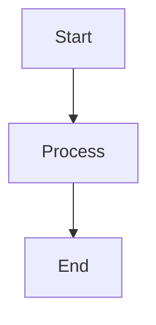

# Architecture Documentation
## AI Code Assistant Integration for SDLC Platform

This directory contains comprehensive technical architecture diagrams for integrating AI code assistant capabilities into the existing SDLC Automation Platform. All diagrams are created using Mermaid syntax for easy rendering and maintenance.

---

## 📊 Diagram Overview

### [01-system-overview.mmd](./01-system-overview.mmd)
**Overall System Architecture**
- Three-tier enhancement strategy (Platform → Orchestration → GitHub)
- Component relationships and data flow
- User interaction patterns
- External service integrations

**Key Insights:**
- Unified BYOK approach across all AI providers
- Clear separation of concerns between layers
- Scalable microservice architecture

### [02-ai-orchestration-layer.mmd](./02-ai-orchestration-layer.mmd)
**AI Orchestration Layer - Detailed Architecture**
- Microservice internal structure
- Provider abstraction and selection logic
- Security and monitoring components
- API gateway and business logic layers

**Key Insights:**
- Multi-provider support with intelligent routing
- Enterprise-grade security with encryption
- Comprehensive observability and monitoring

### [03-github-integration-workflows.mmd](./03-github-integration-workflows.mmd)
**GitHub Integration Hub - Workflow Architecture**
- Automated bug fixing workflows
- Feature implementation automation
- Quality assurance and human review processes
- Post-merge deployment automation

**Key Insights:**
- Human-in-the-loop approval required for all changes
- Comprehensive testing and quality gates
- Automated deployment with rollback capabilities

### [04-byok-security-architecture.mmd](./04-byok-security-architecture.mmd)
**BYOK Security Architecture**
- Multi-layer security implementation
- API key encryption and management
- Compliance and audit requirements
- Incident response procedures

**Key Insights:**
- Defense in depth security strategy
- Zero-trust architecture principles
- Comprehensive audit and compliance capabilities

### [05-data-flow-diagram.mmd](./05-data-flow-diagram.mmd)
**Data Flow Diagram**
- End-to-end data transformation
- Context preparation and AI processing
- Code generation and application flow
- Feedback loops and continuous improvement

**Key Insights:**
- Clear data transformation stages
- Multiple quality validation points
- Continuous learning and optimization

### [06-deployment-architecture.mmd](./06-deployment-architecture.mmd)
**Deployment Architecture**
- Kubernetes-based containerized deployment
- Infrastructure components and scaling
- CI/CD pipeline integration
- Monitoring and backup strategies

**Key Insights:**
- Production-ready Kubernetes deployment
- High availability and auto-scaling
- Comprehensive backup and disaster recovery

### [07-user-journey-flows.mmd](./07-user-journey-flows.mmd)
**User Journey Flows**
- Different user persona workflows
- Onboarding and configuration processes
- Cross-functional collaboration patterns
- Decision points and error handling

**Key Insights:**
- User-centered design approach
- Clear onboarding and support processes
- Multi-persona collaboration workflows

### [08-api-sequence-diagrams.mmd](./08-api-sequence-diagrams.mmd)
**API Sequence Diagrams**
- Inter-component communication patterns
- BYOK configuration sequences
- Error handling and recovery flows
- Provider selection logic

**Key Insights:**
- Detailed API interaction patterns
- Robust error handling and recovery
- Secure key management flows

### [09-database-schema.mmd](./09-database-schema.mmd)
**Database Schema Design**
- Complete data model for AI integration
- Table relationships and constraints
- Audit and usage tracking tables
- Security and compliance data structures

**Key Insights:**
- Comprehensive data model design
- Strong data integrity and relationships
- Built-in audit and compliance support

---

## 🛠️ How to Use These Diagrams

### For Development Teams
1. **Start with `01-system-overview.mmd`** to understand the overall architecture
2. **Review `02-ai-orchestration-layer.mmd`** for microservice implementation details
3. **Study `08-api-sequence-diagrams.mmd`** for API integration patterns
4. **Reference `09-database-schema.mmd`** for data model implementation

### For Product Managers
1. **Begin with `07-user-journey-flows.mmd`** to understand user experiences
2. **Review `01-system-overview.mmd`** for business value and capabilities
3. **Check `03-github-integration-workflows.mmd`** for automation capabilities
4. **Study `05-data-flow-diagram.mmd`** for end-to-end process understanding

### For Security Teams
1. **Focus on `04-byok-security-architecture.mmd`** for security implementation
2. **Review `02-ai-orchestration-layer.mmd`** for security components
3. **Study `08-api-sequence-diagrams.mmd`** for secure API patterns
4. **Check `09-database-schema.mmd`** for data security measures

### For DevOps Teams
1. **Start with `06-deployment-architecture.mmd`** for infrastructure requirements
2. **Review `02-ai-orchestration-layer.mmd`** for service dependencies
3. **Study `03-github-integration-workflows.mmd`** for CI/CD integration
4. **Check monitoring components across all diagrams

---

## 🎨 Rendering the Diagrams

### Using Mermaid Live Editor
1. Visit [mermaid.live](https://mermaid.live)
2. Copy the content from any `.mmd` file
3. Paste into the editor for live rendering

### Using VS Code
1. Install the "Mermaid Preview" extension
2. Open any `.mmd` file
3. Use `Ctrl+Shift+P` → "Mermaid: Preview"

### Using GitHub/GitLab
All diagrams will render automatically when viewing `.mmd` files in GitHub or GitLab repositories.

### Embedding in Documentation
```markdown

```

---

## 📝 Implementation Guidelines

### Phase 1: Foundation (Weeks 1-4)
**Primary Diagrams:**
- `02-ai-orchestration-layer.mmd` - Service architecture
- `04-byok-security-architecture.mmd` - Security implementation
- `09-database-schema.mmd` - Data model setup

### Phase 2: Core Integration (Weeks 5-8)
**Primary Diagrams:**
- `03-github-integration-workflows.mmd` - Automation workflows
- `08-api-sequence-diagrams.mmd` - API integration patterns
- `05-data-flow-diagram.mmd` - Data processing flows

### Phase 3: Advanced Features (Weeks 9-12)
**Primary Diagrams:**
- `01-system-overview.mmd` - Complete system integration
- `07-user-journey-flows.mmd` - User experience optimization
- `06-deployment-architecture.mmd` - Production deployment

### Phase 4: Production Polish (Weeks 13-16)
**Primary Diagrams:**
- All diagrams for comprehensive system validation
- Focus on monitoring and observability components
- User experience and security hardening

---

## 🔄 Diagram Maintenance

### Version Control
- All diagrams are version controlled with the codebase
- Changes should be reviewed as part of architecture review process
- Use semantic versioning for major architectural changes

### Updates and Reviews
- Review diagrams during sprint planning
- Update diagrams when implementing architectural changes
- Validate diagrams against actual implementation regularly

### Documentation Standards
- Use consistent naming conventions across diagrams
- Include clear annotations and explanations
- Maintain color coding standards for component types

---

## 📚 Additional Resources

### Architecture Decision Records (ADRs)
- Document key architectural decisions referenced in diagrams
- Include rationale for technology choices
- Maintain decision history and alternatives considered

### Implementation Guides
- Detailed technical specifications for each component
- Step-by-step implementation instructions
- Configuration examples and best practices

### Monitoring and Operations
- Deployment runbooks based on architecture diagrams
- Incident response procedures
- Performance tuning guidelines

---

## 🤝 Contributing

### Adding New Diagrams
1. Follow the naming convention: `##-descriptive-name.mmd`
2. Include comprehensive comments and annotations
3. Update this README with diagram description
4. Ensure consistent styling and color schemes

### Modifying Existing Diagrams
1. Create a branch for architectural changes
2. Update relevant diagrams and documentation
3. Review changes with architecture team
4. Validate against implementation requirements

### Best Practices
- Keep diagrams focused and readable
- Use consistent terminology across all diagrams
- Include legends and explanations where helpful
- Test diagram rendering in multiple environments

---

This architecture documentation serves as the foundation for implementing a world-class AI-powered development automation platform. Each diagram provides a different perspective on the system, ensuring comprehensive understanding for all stakeholders.

For questions or clarifications about any diagram, please refer to the detailed technical design documents in the `/docs` directory or reach out to the architecture team. 