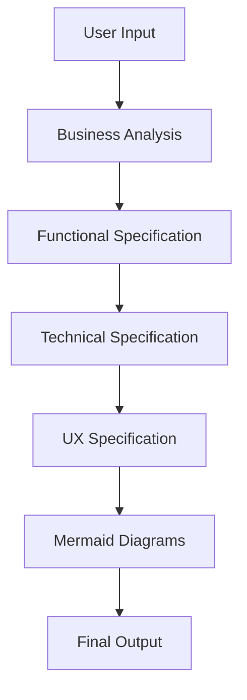
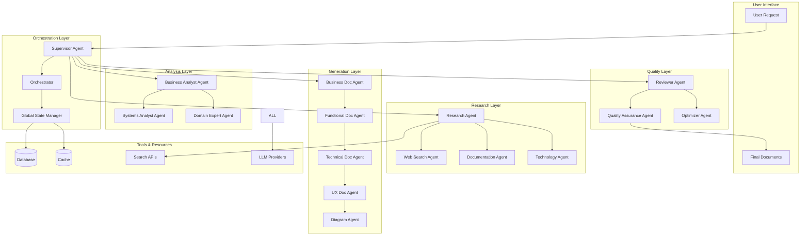

# LangGraph.js Multi-Agent Architecture for SDLC Automation Platform

## Executive Summary

This document outlines the architecture, design, and implementation strategy for migrating the SDLC Automation Platform from its current sequential document generation approach to a sophisticated multi-agent system using LangGraph.js. The new architecture will enable parallel processing, intelligent task decomposition, deep research capabilities, and enhanced document quality through specialized agents working under a supervisor pattern.

## Table of Contents

1. [Current State Analysis](#current-state-analysis)
2. [Proposed Architecture](#proposed-architecture)
3. [Agent Specifications](#agent-specifications)
4. [Implementation Strategy](#implementation-strategy)
5. [Migration Roadmap](#migration-roadmap)
6. [Technical Considerations](#technical-considerations)
7. [Risk Assessment & Mitigation](#risk-assessment--mitigation)

## Current State Analysis

### Existing Document Generation Flow

The current implementation follows a **sequential waterfall pattern**:



**Key Components:**
- **Single AI Call per Document**: Each document type is generated with one AI call
- **Context Passing**: Previous documents are passed as context to subsequent generations
- **Prompt Management**: 3-tier fallback system (Custom → Database → Hardcoded)
- **Context Optimization**: Smart summarization to reduce token usage

**Limitations:**
1. **Sequential Processing**: Documents must be generated in order
2. **Limited Depth**: Single-pass generation without iterative refinement
3. **No Specialization**: Same model handles all document types
4. **No Research Phase**: Direct generation without information gathering
5. **Limited Quality Control**: No automated review or improvement cycles

### Enhanced Features in Feature Branch

The `feature/subsection-generation-formatting` branch introduces:
- **Sub-document Generation**: Each main document is broken into sections
- **Detailed Specifications**: More granular content generation
- **Improved Structure**: Better document organization

## Proposed Architecture

### High-Level Multi-Agent System



### Core Architecture Principles

1. **Supervisor Pattern**: Central coordinator managing all agent interactions
2. **Parallel Processing**: Multiple agents work simultaneously
3. **Iterative Refinement**: Documents improved through multiple passes
4. **Specialized Expertise**: Each agent has specific domain knowledge
5. **Shared State**: Global state management for agent coordination
6. **Tool Integration**: Agents have access to specialized tools

## Agent Specifications

### 1. Supervisor Agent

**Role**: Orchestrates the entire document generation workflow

**Responsibilities:**
- Task decomposition and planning
- Agent selection and assignment
- Progress monitoring and coordination
- Quality gate enforcement
- Error handling and recovery

**Tools:**
- Agent registry and capabilities database
- Task queue management
- Performance monitoring
- Decision tree for agent selection

**Implementation:**
```typescript
interface SupervisorAgent {
  plan(request: SDLCRequest): ExecutionPlan;
  assignTasks(plan: ExecutionPlan): TaskAssignments;
  monitorProgress(): ProgressReport;
  handleFailures(error: AgentError): RecoveryStrategy;
  evaluateResults(results: AgentResults): QualityAssessment;
}
```

### 2. Research Agents

#### 2.1 Research Coordinator Agent

**Role**: Manages research phase for gathering relevant information

**Responsibilities:**
- Identify research requirements
- Coordinate sub-research agents
- Aggregate and synthesize findings
- Build knowledge base

**Tools:**
- Web search integration
- Documentation databases
- Technology stack databases
- Industry best practices repository

#### 2.2 Web Search Agent

**Role**: Searches for current information and best practices

**Tools:**
- Google Search API
- Stack Overflow API
- GitHub repository search
- Technical documentation sites

#### 2.3 Documentation Agent

**Role**: Analyzes existing documentation and standards

**Tools:**
- Documentation parsers
- Standard templates database
- Compliance requirements database

#### 2.4 Technology Agent

**Role**: Researches technology stacks and architectural patterns

**Tools:**
- Technology comparison databases
- Architecture pattern libraries
- Performance benchmarks
- Security guidelines

### 3. Analysis Agents

#### 3.1 Business Analyst Agent

**Role**: Analyzes business requirements and constraints

**Responsibilities:**
- Stakeholder analysis
- Business objective extraction
- ROI calculation
- Risk assessment
- Success criteria definition

**Context Required:**
- User input
- Research findings
- Industry standards

#### 3.2 Systems Analyst Agent

**Role**: Analyzes system requirements and technical constraints

**Responsibilities:**
- System boundary definition
- Integration point identification
- Data flow analysis
- Performance requirements
- Security requirements

#### 3.3 Domain Expert Agent

**Role**: Provides domain-specific expertise

**Responsibilities:**
- Domain model creation
- Business rule extraction
- Terminology standardization
- Compliance verification

### 4. Generation Agents

#### 4.1 Business Document Agent

**Role**: Generates comprehensive business analysis

**Sub-agents:**
- Executive Summary Agent
- Stakeholder Analysis Agent
- Risk Assessment Agent
- Timeline Agent
- Budget Agent

**Output Structure:**
```typescript
interface BusinessDocument {
  executiveSummary: Section;
  businessObjectives: Section;
  stakeholderAnalysis: Section;
  successCriteria: Section;
  riskAssessment: Section;
  timeline: Section;
  budget: Section;
  recommendations: Section;
}
```

#### 4.2 Functional Document Agent

**Role**: Generates detailed functional specifications

**Sub-agents:**
- Requirements Agent
- User Story Agent
- Use Case Agent
- Data Model Agent
- Workflow Agent

**Output Structure:**
```typescript
interface FunctionalDocument {
  functionalRequirements: Requirement[];
  userStories: UserStory[];
  useCases: UseCase[];
  dataRequirements: DataModel;
  workflows: Workflow[];
  integrationRequirements: Integration[];
  performanceRequirements: Performance[];
}
```

#### 4.3 Technical Document Agent

**Role**: Generates comprehensive technical specifications

**Sub-agents:**
- Architecture Agent
- Database Design Agent
- API Design Agent
- Security Design Agent
- Infrastructure Agent

**Output Structure:**
```typescript
interface TechnicalDocument {
  systemArchitecture: Architecture;
  technologyStack: TechStack;
  databaseDesign: DatabaseSchema;
  apiSpecifications: APISpec[];
  securityImplementation: Security;
  deploymentStrategy: Deployment;
  monitoringStrategy: Monitoring;
}
```

#### 4.4 UX Document Agent

**Role**: Generates UX/UI specifications

**Sub-agents:**
- Persona Agent
- Journey Map Agent
- Wireframe Agent
- Component Design Agent
- Accessibility Agent

#### 4.5 Diagram Agent

**Role**: Generates technical diagrams

**Sub-agents:**
- Architecture Diagram Agent
- Sequence Diagram Agent
- Entity Relationship Agent
- Flow Diagram Agent

### 5. Quality Agents

#### 5.1 Reviewer Agent

**Role**: Reviews generated documents for quality

**Responsibilities:**
- Consistency checking
- Completeness verification
- Technical accuracy validation
- Best practice compliance

#### 5.2 Quality Assurance Agent

**Role**: Ensures document quality standards

**Responsibilities:**
- Grammar and spelling check
- Format standardization
- Cross-reference validation
- Requirement traceability

#### 5.3 Optimizer Agent

**Role**: Optimizes document content

**Responsibilities:**
- Content refinement
- Redundancy elimination
- Clarity improvement
- Structure optimization

## Implementation Strategy

### Phase 1: Foundation Setup (Week 1-2)

#### 1.1 Install and Configure LangGraph.js
```typescript
// Core dependencies
npm install @langchain/langgraph @langchain/core @langchain/openai @langchain/anthropic

// Additional tools
npm install zod uuid @types/uuid
```

#### 1.2 Create Base Agent Framework
```typescript
// lib/agents/base-agent.ts
import { BaseMessage, HumanMessage, AIMessage } from "@langchain/core/messages";
import { StateGraph, END } from "@langchain/langgraph";

export interface AgentState {
  messages: BaseMessage[];
  context: Record<string, any>;
  results: Record<string, any>;
  errors: string[];
  status: 'pending' | 'running' | 'completed' | 'failed';
}

export abstract class BaseAgent {
  protected name: string;
  protected description: string;
  protected tools: Tool[];
  protected model: ChatModel;
  
  abstract async execute(state: AgentState): Promise<AgentState>;
  abstract async validate(state: AgentState): Promise<boolean>;
}
```

#### 1.3 Implement State Management
```typescript
// lib/agents/state-manager.ts
export class GlobalStateManager {
  private state: Map<string, any> = new Map();
  private history: StateHistory[] = [];
  
  async get(key: string): Promise<any> {
    return this.state.get(key);
  }
  
  async set(key: string, value: any): Promise<void> {
    this.history.push({ key, value, timestamp: new Date() });
    this.state.set(key, value);
  }
  
  async checkpoint(): Promise<string> {
    // Create state checkpoint for recovery
  }
  
  async restore(checkpointId: string): Promise<void> {
    // Restore from checkpoint
  }
}
```

### Phase 2: Supervisor Implementation (Week 2-3)

#### 2.1 Create Supervisor Agent
```typescript
// lib/agents/supervisor-agent.ts
import { StateGraph, END } from "@langchain/langgraph";
import { BaseAgent } from "./base-agent";

export class SupervisorAgent extends BaseAgent {
  private graph: StateGraph;
  private agents: Map<string, BaseAgent>;
  
  constructor() {
    super();
    this.graph = new StateGraph({
      channels: {
        messages: {
          value: (x: BaseMessage[], y: BaseMessage[]) => x.concat(y),
          default: () => [],
        },
        context: {
          value: (x: any, y: any) => ({ ...x, ...y }),
          default: () => ({}),
        },
      },
    });
    
    this.setupGraph();
  }
  
  private setupGraph() {
    // Define nodes
    this.graph.addNode("research", this.researchPhase.bind(this));
    this.graph.addNode("analysis", this.analysisPhase.bind(this));
    this.graph.addNode("generation", this.generationPhase.bind(this));
    this.graph.addNode("quality", this.qualityPhase.bind(this));
    this.graph.addNode("supervisor", this.supervise.bind(this));
    
    // Define edges
    this.graph.addEdge("research", "analysis");
    this.graph.addEdge("analysis", "generation");
    this.graph.addEdge("generation", "quality");
    this.graph.addConditionalEdges(
      "quality",
      this.shouldContinue.bind(this),
      {
        continue: "generation",
        end: END,
      }
    );
    
    // Set entry point
    this.graph.setEntryPoint("supervisor");
  }
  
  private async supervise(state: AgentState): Promise<AgentState> {
    // Orchestration logic
    const plan = await this.createExecutionPlan(state);
    const assignments = await this.assignTasks(plan);
    return { ...state, context: { ...state.context, plan, assignments } };
  }
  
  private async researchPhase(state: AgentState): Promise<AgentState> {
    const researchAgent = this.agents.get("research");
    return await researchAgent.execute(state);
  }
  
  private async shouldContinue(state: AgentState): Promise<string> {
    const quality = state.context.qualityScore || 0;
    return quality >= 0.8 ? "end" : "continue";
  }
}
```

### Phase 3: Research Agents (Week 3-4)

#### 3.1 Implement Research Coordinator
```typescript
// lib/agents/research/research-coordinator.ts
export class ResearchCoordinator extends BaseAgent {
  private subAgents: ResearchAgent[];
  
  async execute(state: AgentState): Promise<AgentState> {
    // 1. Analyze research requirements
    const requirements = await this.analyzeRequirements(state);
    
    // 2. Parallel research execution
    const researchTasks = requirements.map(req => 
      this.executeResearch(req, state)
    );
    const results = await Promise.all(researchTasks);
    
    // 3. Synthesize findings
    const synthesis = await this.synthesizeFindings(results);
    
    return {
      ...state,
      context: {
        ...state.context,
        research: synthesis,
      },
    };
  }
  
  private async analyzeRequirements(state: AgentState): Promise<ResearchRequirement[]> {
    // Use LLM to identify what research is needed
    const prompt = `
      Given the following project requirements:
      ${state.context.userInput}
      
      Identify the key areas that need research:
      1. Technologies and frameworks
      2. Best practices and patterns
      3. Security considerations
      4. Performance benchmarks
      5. Similar implementations
    `;
    
    return await this.model.invoke(prompt);
  }
}
```

#### 3.2 Implement Web Search Agent
```typescript
// lib/agents/research/web-search-agent.ts
import { WebSearchTool } from "../tools/web-search";

export class WebSearchAgent extends BaseAgent {
  private searchTool: WebSearchTool;
  
  async execute(state: AgentState): Promise<AgentState> {
    const queries = this.generateSearchQueries(state);
    const searchResults = await this.performSearches(queries);
    const relevantInfo = await this.extractRelevantInfo(searchResults);
    
    return {
      ...state,
      context: {
        ...state.context,
        webResearch: relevantInfo,
      },
    };
  }
  
  private generateSearchQueries(state: AgentState): string[] {
    // Generate targeted search queries based on requirements
  }
  
  private async performSearches(queries: string[]): Promise<SearchResult[]> {
    return await Promise.all(
      queries.map(q => this.searchTool.search(q))
    );
  }
}
```

### Phase 4: Generation Agents (Week 4-5)

#### 4.1 Implement Business Document Agent
```typescript
// lib/agents/generation/business-document-agent.ts
export class BusinessDocumentAgent extends BaseAgent {
  private sectionAgents: Map<string, SectionAgent>;
  
  constructor() {
    super();
    this.sectionAgents = new Map([
      ["executive", new ExecutiveSummaryAgent()],
      ["stakeholder", new StakeholderAnalysisAgent()],
      ["risk", new RiskAssessmentAgent()],
      ["timeline", new TimelineAgent()],
      ["budget", new BudgetAgent()],
    ]);
  }
  
  async execute(state: AgentState): Promise<AgentState> {
    const sections = {};
    
    // Generate each section in parallel
    const sectionPromises = Array.from(this.sectionAgents.entries()).map(
      async ([key, agent]) => {
        const section = await agent.generateSection(state);
        return { key, section };
      }
    );
    
    const results = await Promise.all(sectionPromises);
    results.forEach(({ key, section }) => {
      sections[key] = section;
    });
    
    // Combine sections into final document
    const document = await this.combineDocument(sections);
    
    return {
      ...state,
      results: {
        ...state.results,
        businessDocument: document,
      },
    };
  }
  
  private async combineDocument(sections: Record<string, Section>): Promise<Document> {
    // Combine and format sections into cohesive document
  }
}
```

#### 4.2 Section-Specific Sub-Agents
```typescript
// lib/agents/generation/sections/executive-summary-agent.ts
export class ExecutiveSummaryAgent extends SectionAgent {
  async generateSection(state: AgentState): Promise<Section> {
    const prompt = this.buildPrompt(state);
    const content = await this.model.invoke(prompt);
    
    return {
      title: "Executive Summary",
      content,
      metadata: {
        generatedAt: new Date(),
        wordCount: content.split(" ").length,
        confidence: 0.9,
      },
    };
  }
  
  private buildPrompt(state: AgentState): string {
    return `
      Based on the following research and analysis:
      ${JSON.stringify(state.context.research)}
      ${JSON.stringify(state.context.analysis)}
      
      Generate a comprehensive executive summary that:
      1. Highlights key business objectives
      2. Summarizes main challenges and opportunities
      3. Provides clear recommendations
      4. Outlines expected outcomes
      
      Format: Professional business document style
      Length: 300-500 words
    `;
  }
}
```

### Phase 5: Quality Agents (Week 5-6)

#### 5.1 Implement Reviewer Agent
```typescript
// lib/agents/quality/reviewer-agent.ts
export class ReviewerAgent extends BaseAgent {
  async execute(state: AgentState): Promise<AgentState> {
    const documents = this.extractDocuments(state);
    const reviewResults = await this.reviewDocuments(documents);
    const improvements = await this.suggestImprovements(reviewResults);
    
    return {
      ...state,
      context: {
        ...state.context,
        review: {
          results: reviewResults,
          improvements,
          qualityScore: this.calculateQualityScore(reviewResults),
        },
      },
    };
  }
  
  private async reviewDocuments(documents: Document[]): Promise<ReviewResult[]> {
    return await Promise.all(
      documents.map(doc => this.reviewDocument(doc))
    );
  }
  
  private async reviewDocument(document: Document): Promise<ReviewResult> {
    const checks = [
      this.checkCompleteness(document),
      this.checkConsistency(document),
      this.checkAccuracy(document),
      this.checkClarity(document),
    ];
    
    const results = await Promise.all(checks);
    
    return {
      documentId: document.id,
      checks: results,
      overallScore: this.calculateScore(results),
    };
  }
}
```

### Phase 6: Integration Layer (Week 6-7)

#### 6.1 Create Main Workflow
```typescript
// lib/workflows/sdlc-workflow.ts
import { StateGraph } from "@langchain/langgraph";
import { SupervisorAgent } from "../agents/supervisor-agent";

export class SDLCWorkflow {
  private graph: StateGraph;
  private supervisor: SupervisorAgent;
  
  constructor() {
    this.supervisor = new SupervisorAgent();
    this.graph = this.supervisor.getGraph();
  }
  
  async execute(request: SDLCRequest): Promise<SDLCResponse> {
    const initialState: AgentState = {
      messages: [new HumanMessage(request.input)],
      context: {
        userInput: request.input,
        projectId: request.projectId,
        userId: request.userId,
      },
      results: {},
      errors: [],
      status: 'pending',
    };
    
    const finalState = await this.graph.invoke(initialState);
    
    return this.formatResponse(finalState);
  }
  
  private formatResponse(state: AgentState): SDLCResponse {
    return {
      businessAnalysis: state.results.businessDocument,
      functionalSpec: state.results.functionalDocument,
      technicalSpec: state.results.technicalDocument,
      uxSpec: state.results.uxDocument,
      mermaidDiagrams: state.results.diagrams,
      metadata: {
        qualityScore: state.context.review?.qualityScore,
        executionTime: state.context.executionTime,
        agentsUsed: state.context.agentsUsed,
      },
    };
  }
}
```

#### 6.2 Update API Routes
```typescript
// app/api/generate-sdlc/v2/route.ts
import { SDLCWorkflow } from "@/lib/workflows/sdlc-workflow";

export async function POST(req: NextRequest) {
  const workflow = new SDLCWorkflow();
  const request = await req.json();
  
  try {
    const response = await workflow.execute(request);
    return NextResponse.json(response);
  } catch (error) {
    return NextResponse.json(
      { error: error.message },
      { status: 500 }
    );
  }
}
```

## Migration Roadmap

### Phase 1: Preparation (Week 1)
- [ ] Set up development environment
- [ ] Install LangGraph.js dependencies
- [ ] Create project structure
- [ ] Set up testing framework
- [ ] Configure monitoring and logging

### Phase 2: Core Infrastructure (Week 2-3)
- [ ] Implement base agent framework
- [ ] Create state management system
- [ ] Build supervisor agent
- [ ] Set up agent communication
- [ ] Implement error handling

### Phase 3: Agent Development (Week 4-6)
- [ ] Research agents
  - [ ] Research coordinator
  - [ ] Web search agent
  - [ ] Documentation agent
  - [ ] Technology agent
- [ ] Analysis agents
  - [ ] Business analyst
  - [ ] Systems analyst
  - [ ] Domain expert
- [ ] Generation agents
  - [ ] Business document agent
  - [ ] Functional document agent
  - [ ] Technical document agent
  - [ ] UX document agent
  - [ ] Diagram agent
- [ ] Quality agents
  - [ ] Reviewer agent
  - [ ] QA agent
  - [ ] Optimizer agent

### Phase 4: Integration (Week 7)
- [ ] Create main workflow
- [ ] Update API routes
- [ ] Implement caching layer
- [ ] Add monitoring and metrics
- [ ] Create fallback mechanisms

### Phase 5: Testing & Optimization (Week 8)
- [ ] Unit testing for all agents
- [ ] Integration testing
- [ ] Performance optimization
- [ ] Load testing
- [ ] Security audit

### Phase 6: Migration & Deployment (Week 9-10)
- [ ] Create migration scripts
- [ ] Set up feature flags
- [ ] Gradual rollout plan
- [ ] A/B testing setup
- [ ] Production deployment

## Technical Considerations

### 1. Performance Optimization

**Parallel Processing:**
- Utilize Promise.all() for independent agent tasks
- Implement worker threads for CPU-intensive operations
- Use streaming for real-time updates

**Caching Strategy:**
```typescript
interface CacheStrategy {
  research: {
    ttl: 3600, // 1 hour
    key: (query: string) => `research:${hash(query)}`,
  },
  generation: {
    ttl: 86400, // 24 hours
    key: (input: string) => `generation:${hash(input)}`,
  },
}
```

### 2. Error Handling

**Retry Logic:**
```typescript
class RetryHandler {
  async executeWithRetry<T>(
    fn: () => Promise<T>,
    maxRetries: number = 3,
    backoff: number = 1000
  ): Promise<T> {
    for (let i = 0; i < maxRetries; i++) {
      try {
        return await fn();
      } catch (error) {
        if (i === maxRetries - 1) throw error;
        await this.delay(backoff * Math.pow(2, i));
      }
    }
  }
}
```

**Fallback Mechanisms:**
- Graceful degradation to simpler agents
- Use cached results when available
- Fall back to current sequential system

### 3. Monitoring & Observability

**Metrics to Track:**
- Agent execution times
- Success/failure rates
- Token usage per agent
- Quality scores
- Cache hit rates

**Logging Strategy:**
```typescript
interface AgentLog {
  agentId: string;
  executionId: string;
  startTime: Date;
  endTime: Date;
  tokensUsed: number;
  status: 'success' | 'failure';
  error?: string;
  metadata: Record<string, any>;
}
```

### 4. Security Considerations

**Input Validation:**
- Sanitize all user inputs
- Implement rate limiting
- Token budget per request

**Data Protection:**
- Encrypt sensitive data in transit
- Secure agent communication
- Audit logging for compliance

### 5. Scalability Design

**Horizontal Scaling:**
- Stateless agent design
- Distributed state management
- Queue-based task distribution

**Resource Management:**
- Token budget allocation
- Concurrent request limits
- Memory usage optimization

## Risk Assessment & Mitigation

### High-Risk Areas

1. **Complexity Management**
   - Risk: System becomes too complex to maintain
   - Mitigation: Modular design, comprehensive documentation, automated testing

2. **Performance Degradation**
   - Risk: Multi-agent system slower than current
   - Mitigation: Parallel processing, caching, performance monitoring

3. **Cost Increase**
   - Risk: Multiple agents increase API costs
   - Mitigation: Token budgeting, intelligent caching, model selection

4. **Quality Consistency**
   - Risk: Agent coordination issues affect output quality
   - Mitigation: Quality gates, review cycles, fallback mechanisms

### Mitigation Strategies

1. **Phased Rollout**
   - Start with single document type
   - Gradual agent introduction
   - A/B testing with current system

2. **Comprehensive Testing**
   - Unit tests for each agent
   - Integration testing for workflows
   - Load testing for performance

3. **Monitoring & Alerts**
   - Real-time performance tracking
   - Quality score monitoring
   - Cost tracking and alerts

4. **Rollback Plan**
   - Feature flags for instant rollback
   - Maintain current system in parallel
   - Data migration rollback scripts

## Success Metrics

### Key Performance Indicators

1. **Quality Metrics**
   - Document completeness: >95%
   - Consistency score: >90%
   - User satisfaction: >4.5/5

2. **Performance Metrics**
   - Generation time: <30 seconds
   - Parallel efficiency: >70%
   - Cache hit rate: >40%

3. **Cost Metrics**
   - Cost per generation: <$0.50
   - Token efficiency: 20% reduction
   - Error rate: <5%

4. **User Metrics**
   - Adoption rate: >80%
   - Feature usage: All agents utilized
   - Feedback score: Positive trend

## Conclusion

The migration to a LangGraph.js multi-agent architecture represents a significant evolution of the SDLC Automation Platform. This architecture will enable:

1. **Enhanced Quality**: Through specialized agents and iterative refinement
2. **Improved Performance**: Via parallel processing and intelligent caching
3. **Greater Flexibility**: With modular agent design and easy extensibility
4. **Better User Experience**: Through real-time updates and higher quality outputs
5. **Future-Proof Design**: Scalable architecture ready for new capabilities

The implementation will be executed in phases over 10 weeks, with careful attention to testing, monitoring, and risk mitigation. The modular design ensures that each component can be developed, tested, and deployed independently, reducing overall project risk.

## Appendices

### A. Agent Communication Protocol

```typescript
interface AgentMessage {
  id: string;
  from: string;
  to: string;
  type: 'request' | 'response' | 'error';
  payload: any;
  timestamp: Date;
  correlationId: string;
}
```

### B. State Schema

```typescript
interface GlobalState {
  request: SDLCRequest;
  research: ResearchResults;
  analysis: AnalysisResults;
  documents: DocumentMap;
  quality: QualityResults;
  metadata: ExecutionMetadata;
}
```

### C. Tool Specifications

```typescript
interface Tool {
  name: string;
  description: string;
  input_schema: z.ZodSchema;
  output_schema: z.ZodSchema;
  execute: (input: any) => Promise<any>;
}
```

### D. Example Agent Configuration

```yaml
agents:
  research:
    model: gpt-4-turbo-preview
    temperature: 0.7
    max_tokens: 4000
    tools:
      - web_search
      - documentation_search
      - github_search
    
  generation:
    model: claude-3-opus
    temperature: 0.3
    max_tokens: 8000
    tools:
      - template_engine
      - format_validator
    
  quality:
    model: gpt-4
    temperature: 0.1
    max_tokens: 2000
    tools:
      - grammar_checker
      - consistency_validator
```

---

This architecture document provides a comprehensive blueprint for migrating the SDLC Automation Platform to a sophisticated multi-agent system using LangGraph.js. The design emphasizes modularity, scalability, and quality while maintaining backward compatibility and enabling gradual migration.