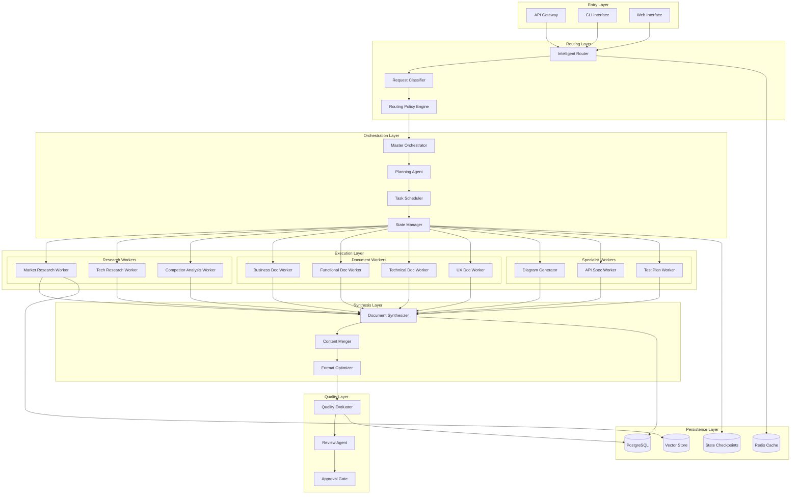
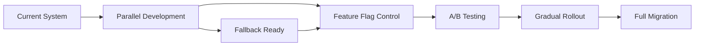
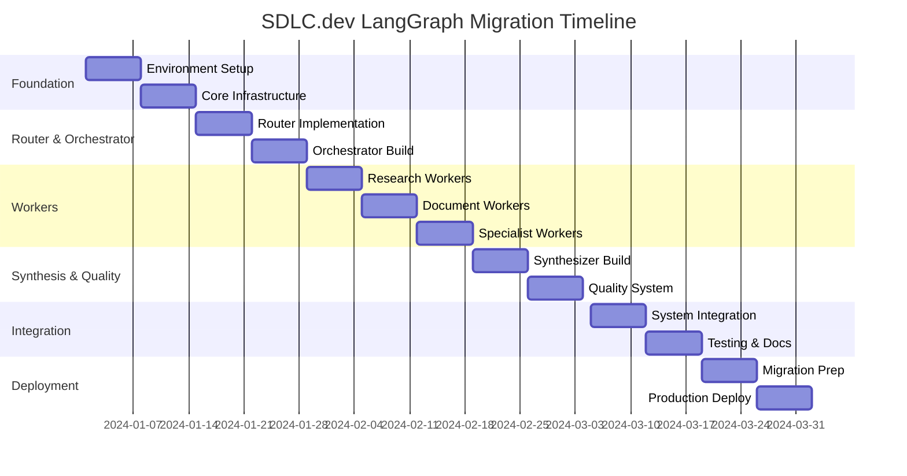

# SDLC.dev LangGraph.js Migration - Detailed Project Plan

## Executive Summary

This document serves as the master project plan for migrating SDLC.dev from its current sequential document generation system to an advanced multi-agent orchestration architecture using LangGraph.js. The new architecture incorporates Router-Orchestrator-Worker patterns, parallel processing capabilities, and intelligent synthesis mechanisms as illustrated in the provided design diagrams.

## Table of Contents

1. [Architecture Analysis](#architecture-analysis)
2. [Target Architecture Design](#target-architecture-design)
3. [Implementation Plan](#implementation-plan)
4. [Migration Strategy](#migration-strategy)
5. [Branch Management](#branch-management)
6. [Timeline & Milestones](#timeline--milestones)
7. [Risk Management](#risk-management)
8. [Success Criteria](#success-criteria)

## Architecture Analysis

### Pattern 1: Router-Orchestrator-Worker-Synthesizer Flow

Based on your first diagram, we'll implement a hierarchical flow:

```
Router → Orchestrator → Workers (1..N) → Synthesizer → Evaluators
```

**Key Benefits:**
- **Router**: Intelligent request classification and routing
- **Orchestrator**: Central coordination and task distribution
- **Workers**: Parallel specialized processing
- **Synthesizer**: Result aggregation and coherence
- **Evaluators**: Quality assurance and validation

### Pattern 2: Multi-Agent Orchestration with Shared State

From your sequence diagram, we identify:
- **Planner Agent**: Decomposes tasks into actionable items
- **Worker Agents**: Execute specific document sections
- **Shared State/CP**: Checkpoint and state management
- **Synthesizer**: Combines outputs into coherent documents
- **Evaluator**: Reviews and validates quality
- **Human Approver**: Final review checkpoint

### Pattern 3: Comprehensive Workflow Architecture

Your third diagram shows:
- **Routing Policy with LLM fallback**
- **Dynamic worker assignment**
- **State persistence layer**
- **Quality gates and approval checkpoints**
- **External tool integration**

## Target Architecture Design

### System Overview



### Core Components

#### 1. Router Component

```typescript
interface RouterConfig {
  rules: RoutingRule[];
  fallbackStrategy: 'llm' | 'default' | 'error';
  classificationModel: string;
  cacheEnabled: boolean;
}

class IntelligentRouter {
  async route(request: SDLCRequest): Promise<RoutingDecision> {
    // 1. Check cache for similar requests
    // 2. Classify request type
    // 3. Apply routing rules
    // 4. Return orchestrator assignment
  }
}
```

#### 2. Orchestrator Component

```typescript
interface OrchestratorState {
  plan: ExecutionPlan;
  tasks: Task[];
  workers: WorkerAssignment[];
  checkpoints: Checkpoint[];
  status: 'planning' | 'executing' | 'synthesizing' | 'evaluating';
}

class MasterOrchestrator {
  private planner: PlanningAgent;
  private scheduler: TaskScheduler;
  private stateManager: StateManager;
  
  async orchestrate(request: RoutedRequest): Promise<SDLCResponse> {
    // 1. Create execution plan
    // 2. Schedule tasks
    // 3. Assign workers
    // 4. Monitor execution
    // 5. Trigger synthesis
    // 6. Quality evaluation
  }
}
```

#### 3. Worker Pool Architecture

```typescript
interface WorkerCapabilities {
  type: 'research' | 'generation' | 'analysis' | 'specialist';
  domains: string[];
  tools: string[];
  maxConcurrency: number;
  timeout: number;
}

abstract class BaseWorker {
  abstract capabilities: WorkerCapabilities;
  abstract async execute(task: Task, context: WorkerContext): Promise<WorkerResult>;
  abstract async validate(result: WorkerResult): Promise<boolean>;
}

class WorkerPool {
  private workers: Map<string, BaseWorker[]>;
  private busy: Set<string>;
  
  async assignWorker(task: Task): Promise<BaseWorker> {
    // Dynamic worker assignment based on task requirements
  }
  
  async executeParallel(tasks: Task[]): Promise<WorkerResult[]> {
    // Parallel execution with resource management
  }
}
```

#### 4. Synthesizer Component

```typescript
interface SynthesisStrategy {
  type: 'merge' | 'hierarchical' | 'sequential' | 'weighted';
  conflictResolution: 'latest' | 'consensus' | 'priority';
  formatOptimization: boolean;
}

class DocumentSynthesizer {
  async synthesize(
    results: WorkerResult[],
    strategy: SynthesisStrategy
  ): Promise<SynthesizedDocument> {
    // 1. Aggregate results
    // 2. Resolve conflicts
    // 3. Ensure coherence
    // 4. Format optimization
    // 5. Cross-reference validation
  }
}
```

#### 5. State Management

```typescript
interface GlobalState {
  requestId: string;
  sessionId: string;
  checkpoints: Checkpoint[];
  artifacts: Map<string, Artifact>;
  metadata: ExecutionMetadata;
  history: StateTransition[];
}

class StateManager {
  private redis: RedisClient;
  private db: DatabaseClient;
  
  async checkpoint(state: GlobalState): Promise<string> {
    // Create recoverable checkpoint
  }
  
  async restore(checkpointId: string): Promise<GlobalState> {
    // Restore from checkpoint
  }
  
  async trackTransition(from: string, to: string, data: any): Promise<void> {
    // Track state transitions for debugging
  }
}
```

## Implementation Plan

### Phase 1: Foundation (Week 1-2)

#### Week 1: Environment Setup & Core Infrastructure
```typescript
// Project structure
sdlc-platform/
├── packages/
│   ├── langgraph-core/        # Core LangGraph integration
│   │   ├── src/
│   │   │   ├── agents/
│   │   │   ├── graphs/
│   │   │   ├── nodes/
│   │   │   ├── edges/
│   │   │   └── state/
│   │   └── package.json
│   ├── router/                 # Routing layer
│   │   ├── src/
│   │   │   ├── classifier/
│   │   │   ├── policies/
│   │   │   └── cache/
│   │   └── package.json
│   ├── orchestrator/           # Orchestration layer
│   │   ├── src/
│   │   │   ├── planner/
│   │   │   ├── scheduler/
│   │   │   └── monitor/
│   │   └── package.json
│   ├── workers/                # Worker implementations
│   │   ├── src/
│   │   │   ├── research/
│   │   │   ├── generation/
│   │   │   ├── analysis/
│   │   │   └── specialist/
│   │   └── package.json
│   ├── synthesizer/            # Synthesis layer
│   │   ├── src/
│   │   │   ├── strategies/
│   │   │   ├── merger/
│   │   │   └── formatter/
│   │   └── package.json
│   └── evaluator/              # Quality layer
│       ├── src/
│       │   ├── metrics/
│       │   ├── validators/
│       │   └── gates/
│       └── package.json
```

**Tasks:**
- [ ] Install LangGraph.js and dependencies
- [ ] Set up monorepo structure with npm workspaces
- [ ] Configure TypeScript for all packages
- [ ] Set up testing framework (Jest + Testing Library)
- [ ] Configure ESLint and Prettier
- [ ] Set up CI/CD pipeline

#### Week 2: Core Components
**Tasks:**
- [ ] Implement BaseAgent abstract class
- [ ] Create StateManager with Redis integration
- [ ] Build Router component with classification
- [ ] Implement basic Orchestrator
- [ ] Set up logging and monitoring

### Phase 2: Router & Orchestrator (Week 3-4)

#### Week 3: Intelligent Router
```typescript
// Implementation milestones
- [ ] Request classifier using LLM
- [ ] Routing policy engine
- [ ] Cache integration for similar requests
- [ ] Fallback mechanisms
- [ ] Router testing suite
```

#### Week 4: Master Orchestrator
```typescript
// Implementation milestones
- [ ] Planning agent with task decomposition
- [ ] Task scheduler with priority queue
- [ ] Worker assignment algorithm
- [ ] Progress monitoring
- [ ] Checkpoint management
```

### Phase 3: Worker Implementation (Week 5-7)

#### Week 5: Research Workers
```typescript
// Research worker types
- [ ] Market Research Worker
    - Industry analysis
    - Competitor research
    - Trend identification
- [ ] Technical Research Worker
    - Technology stack research
    - Best practices gathering
    - Security considerations
- [ ] Domain Research Worker
    - Domain-specific requirements
    - Compliance requirements
    - Industry standards
```

#### Week 6: Document Generation Workers
```typescript
// Document workers with sub-sections
- [ ] Business Document Worker
    - Executive Summary Agent
    - Stakeholder Analysis Agent
    - Risk Assessment Agent
    - ROI Calculator Agent
    - Timeline Generator Agent
    
- [ ] Functional Document Worker
    - Requirements Analyzer Agent
    - User Story Creator Agent
    - Use Case Designer Agent
    - Data Model Designer Agent
    - Workflow Designer Agent
    
- [ ] Technical Document Worker
    - Architecture Designer Agent
    - Database Designer Agent
    - API Designer Agent
    - Security Architect Agent
    - Infrastructure Planner Agent
    
- [ ] UX Document Worker
    - Persona Creator Agent
    - Journey Mapper Agent
    - Wireframe Designer Agent
    - Component Specifier Agent
    - Accessibility Auditor Agent
```

#### Week 7: Specialist Workers
```typescript
// Specialist implementations
- [ ] Diagram Generator Worker
    - Mermaid diagram creation
    - Architecture diagrams
    - Sequence diagrams
    - ER diagrams
    
- [ ] API Specification Worker
    - OpenAPI spec generation
    - GraphQL schema design
    - REST endpoint design
    
- [ ] Test Plan Worker
    - Test strategy creation
    - Test case generation
    - Coverage analysis
```

### Phase 4: Synthesis & Quality (Week 8-9)

#### Week 8: Document Synthesizer
```typescript
// Synthesis components
- [ ] Content aggregation engine
- [ ] Conflict resolution system
- [ ] Coherence validator
- [ ] Cross-reference builder
- [ ] Format optimizer
```

#### Week 9: Quality Evaluator
```typescript
// Quality components
- [ ] Completeness checker
- [ ] Consistency validator
- [ ] Technical accuracy reviewer
- [ ] Grammar and style checker
- [ ] Approval gate system
```

### Phase 5: Integration & Testing (Week 10-11)

#### Week 10: System Integration
- [ ] Connect all components
- [ ] End-to-end workflow testing
- [ ] Performance optimization
- [ ] Error handling and recovery
- [ ] Monitoring and alerting

#### Week 11: Testing & Documentation
- [ ] Unit tests (>80% coverage)
- [ ] Integration tests
- [ ] Load testing
- [ ] Security audit
- [ ] API documentation
- [ ] User documentation

### Phase 6: Migration & Deployment (Week 12-13)

#### Week 12: Migration Preparation
- [ ] Data migration scripts
- [ ] Backward compatibility layer
- [ ] Feature flags setup
- [ ] Rollback procedures
- [ ] Performance benchmarks

#### Week 13: Production Deployment
- [ ] Staged rollout plan
- [ ] A/B testing configuration
- [ ] Monitoring dashboards
- [ ] Alert configuration
- [ ] Production deployment

## Migration Strategy

### 1. Branch Management

```bash
# Current situation
main branch: Latest stable version
feature/subsection-generation-formatting: Sub-document generation features

# Migration approach
1. Create new feature branch from main
   git checkout main
   git pull origin main
   git checkout -b feature/langgraph-migration

2. Merge subsection features
   git merge feature/subsection-generation-formatting
   # Resolve conflicts, focusing on preserving sub-document logic

3. Implement LangGraph architecture
   # Development on feature/langgraph-migration

4. Regular sync with main
   git checkout main
   git pull origin main
   git checkout feature/langgraph-migration
   git merge main
```

### 2. Incremental Migration Path



**Stage 1: Parallel Development**
- Keep existing system operational
- Develop LangGraph system alongside
- Share database and authentication

**Stage 2: Feature Flag Introduction**
```typescript
interface FeatureFlags {
  useNewRouter: boolean;
  useNewOrchestrator: boolean;
  useNewWorkers: boolean;
  useNewSynthesizer: boolean;
  percentageRollout: number;
}
```

**Stage 3: A/B Testing**
- 10% traffic to new system
- Monitor metrics
- Gather feedback
- Iterate on issues

**Stage 4: Gradual Rollout**
- 25% → 50% → 75% → 100%
- Monitor at each stage
- Ready to rollback if needed

### 3. Data Migration

```typescript
// Migration utilities
class DataMigrator {
  async migratePrompts(): Promise<void> {
    // Convert prompts to agent configurations
  }
  
  async migrateProjects(): Promise<void> {
    // Ensure project compatibility
  }
  
  async migrateDocuments(): Promise<void> {
    // Convert documents to new format
  }
}
```

### 4. API Compatibility Layer

```typescript
// Backward compatibility
class CompatibilityAdapter {
  async handleLegacyRequest(request: LegacyRequest): Promise<Response> {
    // Convert to new format
    const newRequest = this.transformRequest(request);
    
    // Process with new system
    const result = await this.newSystem.process(newRequest);
    
    // Convert response to legacy format
    return this.transformResponse(result);
  }
}
```

## Timeline & Milestones

### Project Timeline (13 Weeks)



### Key Milestones

| Week | Milestone | Deliverables | Success Criteria |
|------|-----------|--------------|------------------|
| 2 | Foundation Complete | Core infrastructure ready | All base components functional |
| 4 | Router & Orchestrator | Intelligent routing operational | Request classification >95% accurate |
| 7 | Workers Implemented | All worker types functional | Parallel execution working |
| 9 | Synthesis & Quality | Document generation complete | Quality scores >85% |
| 11 | Integration Complete | End-to-end system working | All tests passing |
| 13 | Production Ready | System deployed | Performance meets SLAs |

## Risk Management

### Technical Risks

| Risk | Impact | Probability | Mitigation |
|------|--------|-------------|------------|
| LangGraph.js learning curve | High | Medium | Training, documentation, expert consultation |
| Performance degradation | High | Low | Benchmarking, optimization, caching |
| Integration complexity | Medium | High | Incremental integration, extensive testing |
| State management issues | High | Medium | Robust checkpointing, recovery mechanisms |
| Worker coordination problems | Medium | Medium | Comprehensive monitoring, timeout handling |

### Mitigation Strategies

#### 1. Performance Optimization
```typescript
// Optimization strategies
- Implement aggressive caching
- Use connection pooling
- Optimize database queries
- Implement request batching
- Use CDN for static assets
```

#### 2. Reliability Measures
```typescript
// Reliability implementations
- Circuit breakers for external services
- Retry logic with exponential backoff
- Graceful degradation
- Health checks and auto-recovery
- Distributed tracing
```

#### 3. Scalability Design
```typescript
// Scalability features
- Horizontal scaling for workers
- Queue-based task distribution
- Database read replicas
- Caching layer (Redis)
- Load balancing
```

## Success Criteria

### Performance Metrics

| Metric | Current | Target | Measurement |
|--------|---------|--------|-------------|
| Document Generation Time | 60s | <30s | P95 latency |
| Concurrent Requests | 10 | 100 | Load testing |
| Quality Score | 75% | >90% | Automated scoring |
| Token Efficiency | Baseline | -30% | Token usage tracking |
| Error Rate | 5% | <2% | Error monitoring |

### Quality Metrics

| Aspect | Target | Measurement |
|--------|--------|-------------|
| Document Completeness | >95% | Automated checks |
| Technical Accuracy | >90% | Review sampling |
| User Satisfaction | >4.5/5 | User surveys |
| Cross-references Valid | 100% | Automated validation |
| Format Compliance | 100% | Schema validation |

### Business Metrics

| Metric | Target | Measurement |
|--------|--------|------------|
| User Adoption | >80% | Usage analytics |
| Cost per Generation | <$0.40 | Cost tracking |
| Support Tickets | -50% | Ticket system |
| Feature Usage | All features >20% | Analytics |
| Customer Retention | >90% | Monthly metrics |

## Implementation Checklist

### Pre-Implementation
- [ ] Review and approve architecture design
- [ ] Set up development environment
- [ ] Allocate team resources
- [ ] Establish communication channels
- [ ] Create project tracking system

### Week 1-2: Foundation
- [ ] Install dependencies
- [ ] Set up project structure
- [ ] Implement base classes
- [ ] Configure testing
- [ ] Set up CI/CD

### Week 3-4: Router & Orchestrator
- [ ] Build router component
- [ ] Implement orchestrator
- [ ] Create planning agent
- [ ] Set up state management
- [ ] Add monitoring

### Week 5-7: Workers
- [ ] Implement research workers
- [ ] Build document workers
- [ ] Create specialist workers
- [ ] Test parallel execution
- [ ] Optimize performance

### Week 8-9: Synthesis & Quality
- [ ] Build synthesizer
- [ ] Implement evaluators
- [ ] Create approval gates
- [ ] Add quality metrics
- [ ] Test end-to-end

### Week 10-11: Integration
- [ ] System integration
- [ ] Performance testing
- [ ] Security audit
- [ ] Documentation
- [ ] User training materials

### Week 12-13: Deployment
- [ ] Migration scripts
- [ ] Feature flags
- [ ] A/B testing
- [ ] Production deployment
- [ ] Post-deployment monitoring

## Appendices

### A. Technology Stack

```yaml
core:
  language: TypeScript
  runtime: Node.js 20+
  framework: Next.js 15
  
orchestration:
  library: LangGraph.js
  llm: OpenAI GPT-4 / Anthropic Claude
  
infrastructure:
  database: PostgreSQL (Supabase)
  cache: Redis
  queue: Bull Queue
  monitoring: DataDog / New Relic
  
testing:
  unit: Jest
  integration: Playwright
  load: K6
  
deployment:
  platform: Vercel / AWS
  ci/cd: GitHub Actions
  containers: Docker
```

### B. Team Structure

```yaml
teams:
  architecture:
    lead: Senior Architect
    members: 2 architects
    
  development:
    lead: Tech Lead
    frontend: 2 developers
    backend: 3 developers
    
  quality:
    lead: QA Lead
    testers: 2 QA engineers
    
  operations:
    lead: DevOps Lead
    engineers: 2 DevOps
```

### C. Communication Plan

```yaml
meetings:
  daily_standup:
    time: 9:00 AM
    duration: 15 minutes
    
  weekly_review:
    time: Friday 2:00 PM
    duration: 1 hour
    
  sprint_planning:
    frequency: Bi-weekly
    duration: 2 hours
    
channels:
  slack:
    - #langgraph-migration
    - #langgraph-dev
    - #langgraph-support
    
  documentation:
    - Confluence
    - GitHub Wiki
```

### D. Budget Estimation

```yaml
costs:
  development:
    hours: 2080 (13 weeks × 160 hours)
    rate: $150/hour
    total: $312,000
    
  infrastructure:
    monthly: $5,000
    total: $15,000 (3 months)
    
  tools_licenses:
    total: $10,000
    
  contingency:
    percentage: 20%
    total: $67,400
    
  grand_total: $404,400
```

## Conclusion

This comprehensive project plan provides a clear roadmap for migrating SDLC.dev to a sophisticated multi-agent architecture using LangGraph.js. The plan incorporates the Router-Orchestrator-Worker-Synthesizer pattern from your design diagrams, ensuring parallel processing, intelligent task distribution, and high-quality document generation.

Key success factors:
1. **Incremental migration** with fallback mechanisms
2. **Comprehensive testing** at each phase
3. **Performance monitoring** throughout
4. **Team alignment** on architecture and goals
5. **Risk mitigation** strategies in place

The 13-week timeline is aggressive but achievable with proper resource allocation and focus. Regular checkpoints and milestones ensure we can adjust course as needed while maintaining momentum toward the production deployment.

---

**Document Version:** 1.0  
**Last Updated:** December 2024  
**Next Review:** Week 2 of Implementation  
**Owner:** SDLC.dev Architecture Team