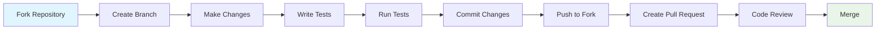

# Contributing to SDLC AI Platform

## 🎉 Welcome Contributors!

Thank you for your interest in contributing to the SDLC AI Platform! This guide will help you get started with contributing to our open-source project.

## 📋 Table of Contents

- [Code of Conduct](#code-of-conduct)
- [Getting Started](#getting-started)
- [Development Setup](#development-setup)
- [Contributing Guidelines](#contributing-guidelines)
- [Pull Request Process](#pull-request-process)
- [Issue Guidelines](#issue-guidelines)
- [Coding Standards](#coding-standards)
- [Testing](#testing)
- [Documentation](#documentation)
- [Community](#community)

## 📜 Code of Conduct

This project and everyone participating in it is governed by our [Code of Conduct](CODE_OF_CONDUCT.md). By participating, you are expected to uphold this code.

### Our Pledge

- **Be Respectful**: Treat everyone with respect and kindness
- **Be Inclusive**: Welcome newcomers and help them learn
- **Be Collaborative**: Work together to improve the project
- **Be Patient**: Help others learn and grow

## 🚀 Getting Started

### Prerequisites

- Node.js 18 or higher
- npm, yarn, or pnpm
- Git
- Supabase account (for database features)
- OpenAI API key (for AI features)

### Quick Start

1. **Fork the repository**
   ```bash
   # Fork on GitHub, then clone your fork
   git clone https://github.com/your-username/sdlc-ai.git
   cd sdlc-ai
   ```

2. **Install dependencies**
   ```bash
   npm install
   ```

3. **Set up environment**
   ```bash
   cp .env.example .env.local
   # Edit .env.local with your configuration
   ```

4. **Run the development server**
   ```bash
   npm run dev
   ```

5. **Open your browser**
   Navigate to [http://localhost:3000](http://localhost:3000)

## 🛠️ Development Setup

### Environment Configuration

Create a `.env.local` file with the following variables:

```env
# Required for basic functionality
NEXT_PUBLIC_SUPABASE_URL=your_supabase_url
NEXT_PUBLIC_SUPABASE_ANON_KEY=your_supabase_anon_key
SUPABASE_SERVICE_ROLE_KEY=your_service_role_key
OPENAI_API_KEY=your_openai_api_key

# App Configuration
NEXT_PUBLIC_APP_URL=http://localhost:3000
NEXTAUTH_URL=http://localhost:3000
NEXTAUTH_SECRET=your_nextauth_secret

# Optional for full functionality
ANTHROPIC_API_KEY=your_anthropic_api_key
JIRA_CLIENT_ID=your_jira_client_id
JIRA_CLIENT_SECRET=your_jira_client_secret

# Slack OAuth Configuration
SLACK_CLIENT_ID=your_slack_client_id
SLACK_CLIENT_SECRET=your_slack_client_secret
SLACK_REDIRECT_URI=http://localhost:3000/api/slack/oauth/callback
SLACK_SIGNING_SECRET=your_slack_signing_secret
NEXT_PUBLIC_SLACK_CLIENT_ID=your_slack_client_id
NEXT_PUBLIC_SLACK_REDIRECT_URI=http://localhost:3000/api/slack/oauth/callback

# GitHub OAuth Configuration
GITHUB_CLIENT_ID=your_github_client_id
GITHUB_CLIENT_SECRET=your_github_client_secret
```

### Database Setup

1. Create a Supabase project
2. Run the setup script:
   ```bash
   # Copy and run the SQL from scripts/setup-database.sql
   # in your Supabase SQL editor
   ```

### Development Commands

```bash
# Start development server
npm run dev

# Build for production
npm run build

# Run tests
npm test

# Run linting
npm run lint

# Fix linting issues
npm run lint:fix

# Type checking
npm run type-check

# Format code
npm run format
```

## 🤝 Contributing Guidelines

### Types of Contributions

We welcome various types of contributions:

- **🐛 Bug Reports**: Help us identify and fix issues
- **✨ Feature Requests**: Suggest new features or improvements
- **📝 Documentation**: Improve our docs, README, or code comments
- **🔧 Code Contributions**: Fix bugs, add features, or improve performance
- **🧪 Testing**: Add or improve tests
- **🎨 Design**: Improve UI/UX or create design assets
- **📢 Community**: Help answer questions, moderate discussions

### Before You Start

1. **Check existing issues**: Search for existing issues or discussions
2. **Create an issue**: For significant changes, create an issue first
3. **Discuss your approach**: Get feedback before starting major work
4. **Start small**: Begin with small contributions to get familiar

### Contribution Workflow



## 🔄 Pull Request Process

### 1. Create a Branch

```bash
# Create a new branch for your feature
git checkout -b feature/amazing-feature

# Or for bug fixes
git checkout -b fix/bug-description

# Or for documentation
git checkout -b docs/update-readme
```

### 2. Make Your Changes

- Write clear, concise code
- Follow our coding standards
- Add tests for new functionality
- Update documentation as needed

### 3. Commit Your Changes

```bash
# Stage your changes
git add .

# Commit with a descriptive message
git commit -m "feat: add amazing new feature

- Add feature X that does Y
- Update documentation
- Add tests for new functionality"
```

### 4. Push to Your Fork

```bash
git push origin feature/amazing-feature
```

### 5. Create a Pull Request

1. Go to your fork on GitHub
2. Click "New Pull Request"
3. Fill out the PR template
4. Link any related issues

### Pull Request Template

```markdown
## Description
Brief description of changes

## Type of Change
- [ ] Bug fix
- [ ] New feature
- [ ] Breaking change
- [ ] Documentation update

## Testing
- [ ] Tests pass locally
- [ ] Added tests for new functionality
- [ ] Manual testing completed

## Checklist
- [ ] Code follows style guidelines
- [ ] Self-review completed
- [ ] Documentation updated
- [ ] No breaking changes (or documented)
```

## 🐛 Issue Guidelines

### Bug Reports

When reporting bugs, please include:

```markdown
## Bug Description
Clear description of the bug

## Steps to Reproduce
1. Go to '...'
2. Click on '....'
3. Scroll down to '....'
4. See error

## Expected Behavior
What should happen

## Actual Behavior
What actually happens

## Environment
- OS: [e.g. macOS, Windows, Linux]
- Browser: [e.g. Chrome, Firefox, Safari]
- Node.js version: [e.g. 18.17.0]
- npm version: [e.g. 9.6.7]

## Additional Context
Screenshots, logs, or other relevant information
```

### Feature Requests

When requesting features, please include:

```markdown
## Feature Description
Clear description of the feature

## Problem Statement
What problem does this solve?

## Proposed Solution
How should this feature work?

## Alternatives Considered
Other approaches you've considered

## Additional Context
Mockups, examples, or relevant information
```

## 📏 Coding Standards

### TypeScript Guidelines

```typescript
// Use explicit types
interface User {
  id: string
  email: string
  name: string
}

// Use proper function signatures
const createUser = async (userData: CreateUserData): Promise<User> => {
  // Implementation
}

// Use proper error handling
try {
  const result = await apiCall()
  return result
} catch (error) {
  console.error('API call failed:', error)
  throw new Error('Failed to create user')
}
```

### React Guidelines

```typescript
// Use proper component structure
interface ComponentProps {
  title: string
  onSubmit: (data: FormData) => void
}

export const MyComponent: React.FC<ComponentProps> = ({ title, onSubmit }) => {
  const [state, setState] = useState<ComponentState>({})
  
  const handleSubmit = useCallback((data: FormData) => {
    onSubmit(data)
  }, [onSubmit])
  
  return (
    <div>
      <h1>{title}</h1>
      {/* Component JSX */}
    </div>
  )
}
```

### Naming Conventions

- **Files**: Use kebab-case for files (`user-profile.tsx`)
- **Components**: Use PascalCase (`UserProfile`)
- **Functions**: Use camelCase (`createUser`)
- **Constants**: Use UPPER_SNAKE_CASE (`API_BASE_URL`)
- **Types/Interfaces**: Use PascalCase (`UserData`)

### Code Organization

```
src/
├── components/          # Reusable components
│   ├── ui/             # Basic UI components
│   └── feature/        # Feature-specific components
├── lib/                # Utility functions and services
├── hooks/              # Custom React hooks
├── types/              # TypeScript type definitions
├── app/                # Next.js app directory
└── styles/             # Global styles
```

### Import Organization

```typescript
// 1. Node modules
import React from 'react'
import { NextPage } from 'next'

// 2. Internal modules (absolute imports)
import { Button } from '@/components/ui/button'
import { createUser } from '@/lib/user-service'

// 3. Relative imports
import './component.css'
```

## 🧪 Testing

### Testing Strategy

We use a comprehensive testing approach:

- **Unit Tests**: Test individual functions and components
- **Integration Tests**: Test feature workflows
- **E2E Tests**: Test complete user journeys

### Writing Tests

```typescript
// Unit test example
import { render, screen } from '@testing-library/react'
import { UserProfile } from './UserProfile'

describe('UserProfile', () => {
  it('renders user information correctly', () => {
    const user = { id: '1', name: 'John Doe', email: 'john@example.com' }
    
    render(<UserProfile user={user} />)
    
    expect(screen.getByText('John Doe')).toBeInTheDocument()
    expect(screen.getByText('john@example.com')).toBeInTheDocument()
  })
})
```

### Running Tests

```bash
# Run all tests
npm test

# Run tests in watch mode
npm run test:watch

# Run tests with coverage
npm run test:coverage

# Run E2E tests
npm run test:e2e
```

## 📚 Documentation

### Code Documentation

```typescript
/**
 * Creates a new user in the database
 * @param userData - The user data to create
 * @returns Promise that resolves to the created user
 * @throws Error if user creation fails
 */
export const createUser = async (userData: CreateUserData): Promise<User> => {
  // Implementation
}
```

### README Updates

When adding new features:

1. Update the main README.md
2. Add usage examples
3. Update the feature list
4. Add configuration instructions

### API Documentation

For new API endpoints:

1. Update `docs/api-reference.md`
2. Include request/response examples
3. Document error cases
4. Add authentication requirements

## 🎯 Specific Contribution Areas

### 🤖 AI Features

- Improve prompt engineering
- Add support for new AI models
- Optimize response parsing
- Add content validation

### 🔗 Integrations

- Add new third-party integrations
- Improve existing integrations
- Add error handling
- Write integration tests

### 🎨 UI/UX

- Improve component design
- Add accessibility features
- Optimize for mobile
- Create new visualizations

### 📊 Performance

- Optimize database queries
- Improve caching strategies
- Reduce bundle size
- Add performance monitoring

### 🔒 Security

- Improve authentication
- Add rate limiting
- Enhance data validation
- Security auditing

## 🏆 Recognition

Contributors will be recognized in:

- **README.md**: Contributors section
- **Release Notes**: Major contribution mentions
- **GitHub**: Contributor badges
- **Discord**: Contributor role (if applicable)

### Contributor Levels

- **First-time Contributors**: Welcome badge
- **Regular Contributors**: Trusted contributor status
- **Core Contributors**: Maintainer privileges
- **Maintainers**: Full repository access

## 📞 Getting Help

### Community Resources

- **GitHub Discussions**: Ask questions and share ideas
- **Issues**: Report bugs and request features
- **Discord**: Real-time chat (if available)
- **Documentation**: Comprehensive guides and references

### Mentorship

New contributors can request mentorship:

1. Comment on a "good first issue"
2. Tag a maintainer for guidance
3. Join our Discord for real-time help
4. Attend virtual office hours (if scheduled)

## 🔄 Review Process

### Code Review Guidelines

All contributions go through code review:

1. **Automated Checks**: CI/CD pipeline runs tests
2. **Peer Review**: At least one maintainer reviews
3. **Feedback**: Constructive feedback provided
4. **Iteration**: Make requested changes
5. **Approval**: Maintainer approves and merges

### Review Criteria

- **Functionality**: Does it work as intended?
- **Code Quality**: Is it well-written and maintainable?
- **Testing**: Are there adequate tests?
- **Documentation**: Is it properly documented?
- **Performance**: Does it impact performance?
- **Security**: Are there security implications?

## 📈 Project Roadmap

### Current Priorities

1. **Core Features**: Improve AI generation quality
2. **Integrations**: Add more third-party services
3. **Performance**: Optimize response times
4. **Documentation**: Improve user guides
5. **Testing**: Increase test coverage

### Future Goals

- Multi-language support
- Real-time collaboration
- Advanced analytics
- Mobile application
- Enterprise features

## 🎉 Thank You!

Thank you for contributing to the SDLC AI Platform! Your contributions help make software development more efficient and accessible for everyone.

### Questions?

If you have any questions about contributing, please:

1. Check our [FAQ](FAQ.md)
2. Search existing [GitHub Issues](https://github.com/your-username/sdlc-ai/issues)
3. Create a new issue with the "question" label
4. Join our community discussions

---

**Happy Contributing! 🚀** 