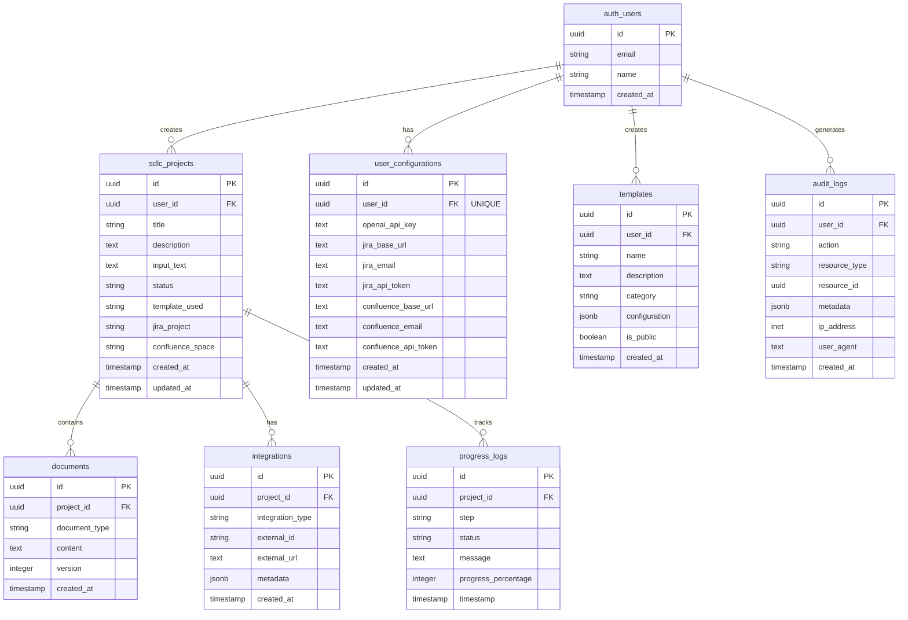

# Database Setup Guide - SDLC AI Platform

## 📋 Overview

This guide walks you through setting up the Supabase database for the SDLC AI platform. The database stores user projects, generated documents, configurations, and integration data with proper security and performance optimizations.

## 🗄️ Database Schema Overview



## 🚀 Quick Setup

### Prerequisites

- Supabase account (free tier is sufficient for development)
- Database admin access to your Supabase project

### Step 1: Create Supabase Project

1. Go to [Supabase Dashboard](https://supabase.com/dashboard)
2. Click "New Project"
3. Choose your organization
4. Enter project details:
   - **Name**: `sdlc-ai-platform`
   - **Database Password**: Generate a strong password
   - **Region**: Choose closest to your users
5. Click "Create new project"

### Step 2: Run Database Setup Script

1. Navigate to **SQL Editor** in your Supabase dashboard
2. Copy the contents of `scripts/setup-database.sql`
3. Paste into the SQL editor
4. Click "Run" to execute the script

### Step 3: Verify Setup

Run this query to verify all tables were created:

```sql
SELECT table_name 
FROM information_schema.tables 
WHERE table_schema = 'public' 
  AND table_name LIKE 'sdlc_%'
ORDER BY table_name;
```

Expected output:
- `sdlc_projects`
- Plus any other tables you may have

## 🔧 Detailed Setup Instructions

### Manual Table Creation

If you prefer to create tables manually or need to understand the structure:

#### 1. SDLC Projects Table

```sql
CREATE TABLE sdlc_projects (
    id UUID PRIMARY KEY DEFAULT gen_random_uuid(),
    user_id UUID REFERENCES auth.users(id) ON DELETE CASCADE,
    title VARCHAR(255) NOT NULL,
    description TEXT,
    input_text TEXT NOT NULL,
    status VARCHAR(50) DEFAULT 'processing',
    template_used VARCHAR(100),
    jira_project VARCHAR(50),
    confluence_space VARCHAR(50),
    created_at TIMESTAMP DEFAULT NOW(),
    updated_at TIMESTAMP DEFAULT NOW()
);
```

#### 2. Documents Table

```sql
CREATE TABLE documents (
    id UUID PRIMARY KEY DEFAULT gen_random_uuid(),
    project_id UUID REFERENCES sdlc_projects(id) ON DELETE CASCADE,
    document_type VARCHAR(50) NOT NULL,
    content TEXT NOT NULL,
    version INTEGER DEFAULT 1,
    created_at TIMESTAMP DEFAULT NOW()
);
```

#### 3. User Configurations Table

```sql
CREATE TABLE user_configurations (
    id UUID PRIMARY KEY DEFAULT gen_random_uuid(),
    user_id UUID REFERENCES auth.users(id) ON DELETE CASCADE UNIQUE,
    openai_api_key TEXT,
    jira_base_url TEXT,
    jira_email TEXT,
    jira_api_token TEXT,
    confluence_base_url TEXT,
    confluence_email TEXT,
    confluence_api_token TEXT,
    created_at TIMESTAMP DEFAULT NOW(),
    updated_at TIMESTAMP DEFAULT NOW()
);
```

#### 4. Integrations Table

```sql
CREATE TABLE integrations (
    id UUID PRIMARY KEY DEFAULT gen_random_uuid(),
    project_id UUID REFERENCES sdlc_projects(id) ON DELETE CASCADE,
    integration_type VARCHAR(50) NOT NULL,
    external_id VARCHAR(255) NOT NULL,
    external_url TEXT,
    metadata JSONB,
    created_at TIMESTAMP DEFAULT NOW()
);
```

#### 5. Progress Logs Table

```sql
CREATE TABLE progress_logs (
    id UUID PRIMARY KEY DEFAULT gen_random_uuid(),
    project_id UUID REFERENCES sdlc_projects(id) ON DELETE CASCADE,
    step VARCHAR(50) NOT NULL,
    status VARCHAR(50) NOT NULL,
    message TEXT,
    progress_percentage INTEGER DEFAULT 0,
    timestamp TIMESTAMP DEFAULT NOW()
);
```

#### 6. Templates Table

```sql
CREATE TABLE templates (
    id UUID PRIMARY KEY DEFAULT gen_random_uuid(),
    user_id UUID REFERENCES auth.users(id) ON DELETE CASCADE,
    name VARCHAR(255) NOT NULL,
    description TEXT,
    category VARCHAR(50) NOT NULL,
    configuration JSONB NOT NULL,
    is_public BOOLEAN DEFAULT false,
    created_at TIMESTAMP DEFAULT NOW()
);
```

#### 7. Audit Logs Table

```sql
CREATE TABLE audit_logs (
    id UUID PRIMARY KEY DEFAULT gen_random_uuid(),
    user_id UUID REFERENCES auth.users(id),
    action VARCHAR(100) NOT NULL,
    resource_type VARCHAR(50),
    resource_id UUID,
    metadata JSONB,
    ip_address INET,
    user_agent TEXT,
    created_at TIMESTAMP DEFAULT NOW()
);
```

## 🔒 Security Setup

### Row Level Security (RLS)

Enable RLS for all tables:

```sql
-- Enable RLS on all tables
ALTER TABLE sdlc_projects ENABLE ROW LEVEL SECURITY;
ALTER TABLE documents ENABLE ROW LEVEL SECURITY;
ALTER TABLE integrations ENABLE ROW LEVEL SECURITY;
ALTER TABLE user_configurations ENABLE ROW LEVEL SECURITY;
ALTER TABLE progress_logs ENABLE ROW LEVEL SECURITY;
ALTER TABLE templates ENABLE ROW LEVEL SECURITY;
ALTER TABLE audit_logs ENABLE ROW LEVEL SECURITY;
```

### RLS Policies

#### Projects Policies

```sql
-- Users can only see their own projects
CREATE POLICY "Users can view own projects" ON sdlc_projects
    FOR SELECT USING (auth.uid() = user_id);

CREATE POLICY "Users can insert own projects" ON sdlc_projects
    FOR INSERT WITH CHECK (auth.uid() = user_id);

CREATE POLICY "Users can update own projects" ON sdlc_projects
    FOR UPDATE USING (auth.uid() = user_id);

CREATE POLICY "Users can delete own projects" ON sdlc_projects
    FOR DELETE USING (auth.uid() = user_id);
```

#### Documents Policies

```sql
-- Users can only see documents for their own projects
CREATE POLICY "Users can view own documents" ON documents
    FOR SELECT USING (
        EXISTS (
            SELECT 1 FROM sdlc_projects 
            WHERE sdlc_projects.id = documents.project_id 
            AND sdlc_projects.user_id = auth.uid()
        )
    );

CREATE POLICY "Users can insert documents for own projects" ON documents
    FOR INSERT WITH CHECK (
        EXISTS (
            SELECT 1 FROM sdlc_projects 
            WHERE sdlc_projects.id = documents.project_id 
            AND sdlc_projects.user_id = auth.uid()
        )
    );
```

#### Configuration Policies

```sql
-- Users can only see their own configurations
CREATE POLICY "Users can view own configurations" ON user_configurations
    FOR SELECT USING (auth.uid() = user_id);

CREATE POLICY "Users can insert own configurations" ON user_configurations
    FOR INSERT WITH CHECK (auth.uid() = user_id);

CREATE POLICY "Users can update own configurations" ON user_configurations
    FOR UPDATE USING (auth.uid() = user_id);
```

## 📊 Performance Optimization

### Indexes

Create indexes for frequently queried columns:

```sql
-- Performance indexes
CREATE INDEX idx_sdlc_projects_user_id ON sdlc_projects(user_id);
CREATE INDEX idx_sdlc_projects_status ON sdlc_projects(status);
CREATE INDEX idx_sdlc_projects_created_at ON sdlc_projects(created_at);
CREATE INDEX idx_documents_project_id ON documents(project_id);
CREATE INDEX idx_documents_type ON documents(document_type);
CREATE INDEX idx_progress_logs_project_id ON progress_logs(project_id);
CREATE INDEX idx_integrations_project_id ON integrations(project_id);
CREATE INDEX idx_user_configurations_user_id ON user_configurations(user_id);
CREATE INDEX idx_audit_logs_user_id ON audit_logs(user_id);
CREATE INDEX idx_audit_logs_created_at ON audit_logs(created_at);
```

### Query Optimization

Example optimized queries:

```sql
-- Get user projects with document counts
SELECT 
    p.*,
    COUNT(d.id) as document_count
FROM sdlc_projects p
LEFT JOIN documents d ON p.id = d.project_id
WHERE p.user_id = auth.uid()
GROUP BY p.id
ORDER BY p.created_at DESC;

-- Get project with all documents
SELECT 
    p.*,
    json_agg(
        json_build_object(
            'id', d.id,
            'type', d.document_type,
            'content', d.content,
            'version', d.version,
            'created_at', d.created_at
        )
    ) as documents
FROM sdlc_projects p
LEFT JOIN documents d ON p.id = d.project_id
WHERE p.id = $1 AND p.user_id = auth.uid()
GROUP BY p.id;
```

## 🔧 Environment Configuration

### Environment Variables

Add these to your `.env.local`:

```env
# Supabase Configuration
NEXT_PUBLIC_SUPABASE_URL=your_supabase_project_url
NEXT_PUBLIC_SUPABASE_ANON_KEY=your_supabase_anon_key
SUPABASE_SERVICE_ROLE_KEY=your_service_role_key

# Database Connection (if needed for direct access)
DATABASE_URL=postgresql://postgres:[password]@[host]:5432/postgres
```

### Supabase Client Configuration

Update your Supabase client configuration:

```typescript
// lib/supabase/client.ts
import { createBrowserClient } from '@supabase/ssr'
import { Database } from '@/database.types'

export const createClient = () =>
  createBrowserClient<Database>(
    process.env.NEXT_PUBLIC_SUPABASE_URL!,
    process.env.NEXT_PUBLIC_SUPABASE_ANON_KEY!
  )
```

## 🧪 Testing the Setup

### Verify Database Connection

```typescript
// Test database connection
import { createClient } from '@/lib/supabase/client'

const testConnection = async () => {
  const supabase = createClient()
  const { data, error } = await supabase
    .from('sdlc_projects')
    .select('count')
    .limit(1)
  
  if (error) {
    console.error('Database connection failed:', error)
  } else {
    console.log('Database connection successful!')
  }
}
```

### Test Data Insertion

```sql
-- Test inserting a sample project (run in SQL editor)
INSERT INTO sdlc_projects (
    user_id,
    title,
    description,
    input_text,
    status
) VALUES (
    auth.uid(),
    'Test Project',
    'This is a test project',
    'We need to build a test application',
    'completed'
);
```

## ⚠️ Important Notes

### User Configuration Unique Constraint

The `user_configurations` table has a **unique constraint** on the `user_id` column to ensure each user has only one configuration record. This prevents:

- Multiple API key records for the same user
- Configuration loading errors due to duplicate records  
- Data consistency problems
- "JSON object requested, multiple rows returned" errors

#### Fixing Duplicate Configuration Records

If you encounter duplicate configuration records, use this cleanup query:

```sql
-- Clean up duplicate user configurations (keeps most recent)
WITH ranked_configs AS (
  SELECT id, user_id, ROW_NUMBER() OVER (PARTITION BY user_id ORDER BY updated_at DESC) as rn
  FROM user_configurations
)
DELETE FROM user_configurations 
WHERE id IN (
  SELECT id FROM ranked_configs WHERE rn > 1
);

-- Verify cleanup worked
SELECT user_id, COUNT(*) as config_count 
FROM user_configurations 
GROUP BY user_id 
HAVING COUNT(*) > 1;
```

#### Adding Unique Constraint to Existing Database

If you're upgrading an existing database, add the unique constraint:

```sql
-- First clean up any duplicates (see above)
-- Then add the unique constraint
ALTER TABLE user_configurations 
ADD CONSTRAINT user_configurations_user_id_unique 
UNIQUE (user_id);
```

## 🚨 Troubleshooting

### Common Issues

#### 1. RLS Policies Not Working

**Problem**: Users can't access their own data
**Solution**: Verify policies are correctly set and `auth.uid()` is available

```sql
-- Check if user is authenticated
SELECT auth.uid();

-- Check existing policies
SELECT * FROM pg_policies WHERE tablename = 'sdlc_projects';
```

#### 2. Foreign Key Violations

**Problem**: Cannot insert records due to foreign key constraints
**Solution**: Ensure referenced records exist

```sql
-- Check if user exists in auth.users
SELECT * FROM auth.users WHERE id = 'your-user-id';
```

#### 3. Permission Denied Errors

**Problem**: Cannot perform operations on tables
**Solution**: Verify RLS is properly configured

```sql
-- Temporarily disable RLS for testing (NOT for production)
ALTER TABLE sdlc_projects DISABLE ROW LEVEL SECURITY;
```

### Performance Issues

#### 1. Slow Queries

**Problem**: Queries taking too long
**Solution**: Check if indexes are created

```sql
-- Check existing indexes
SELECT indexname, tablename, indexdef 
FROM pg_indexes 
WHERE tablename LIKE 'sdlc_%';
```

#### 2. Connection Pool Exhaustion

**Problem**: Too many database connections
**Solution**: Use connection pooling

```typescript
// Configure connection pooling in Supabase client
const supabase = createClient({
  auth: {
    persistSession: true,
    autoRefreshToken: true,
  },
  db: {
    schema: 'public',
  },
  global: {
    headers: { 'x-my-custom-header': 'my-app-name' },
  },
})
```

## 📈 Monitoring and Maintenance

### Database Monitoring

1. **Supabase Dashboard**: Monitor query performance and database metrics
2. **Query Performance**: Use `EXPLAIN ANALYZE` for slow queries
3. **Storage Usage**: Monitor table sizes and growth
4. **Connection Usage**: Track active connections

### Backup Strategy

1. **Automatic Backups**: Supabase provides automatic daily backups
2. **Manual Backups**: Export data before major changes
3. **Point-in-Time Recovery**: Available for Pro and Enterprise plans

### Maintenance Tasks

```sql
-- Analyze table statistics (run monthly)
ANALYZE sdlc_projects;
ANALYZE documents;
ANALYZE user_configurations;

-- Check table sizes
SELECT 
    tablename,
    pg_size_pretty(pg_total_relation_size(tablename::regclass)) as size
FROM pg_tables 
WHERE schemaname = 'public' 
    AND tablename LIKE 'sdlc_%'
ORDER BY pg_total_relation_size(tablename::regclass) DESC;
```

## 🔄 Migration and Updates

### Schema Migrations

When updating the database schema:

1. **Create Migration Script**: Document all changes
2. **Test in Development**: Verify migrations work correctly
3. **Backup Production**: Always backup before migrations
4. **Apply Incrementally**: Use versioned migration scripts

### Data Migration

For migrating from localStorage to database:

```typescript
// Example migration script
const migrateLocalStorageData = async () => {
  const projects = JSON.parse(localStorage.getItem('sdlc-projects') || '[]')
  
  for (const project of projects) {
    await dbService.createProject({
      user_id: user.id,
      title: project.title,
      input_text: project.input,
      status: 'completed'
    })
  }
  
  // Clear localStorage after successful migration
  localStorage.removeItem('sdlc-projects')
}
```

---

This setup provides a robust, secure, and scalable database foundation for the SDLC AI platform. 