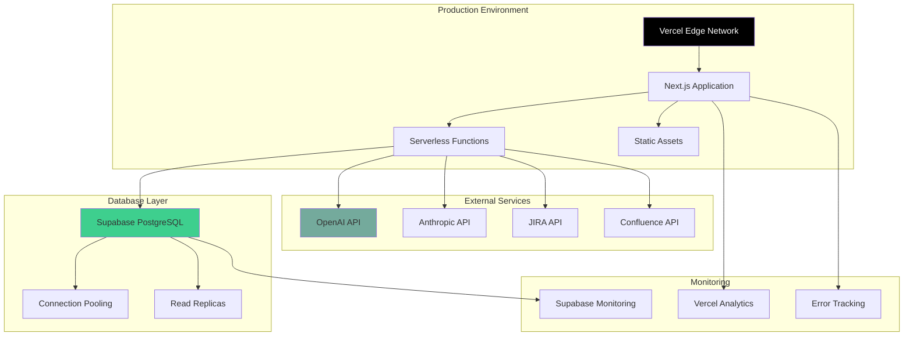

# Deployment Guide - SDLC AI Platform

## 🚀 Overview

This guide covers deploying the SDLC AI Platform to production environments. The platform is designed to be deployed on Vercel with Supabase as the backend, but can be adapted for other platforms.

## 🏗️ Architecture Overview



## 📋 Prerequisites

### Required Accounts
- [Vercel](https://vercel.com) account
- [Supabase](https://supabase.com) account
- [OpenAI](https://openai.com) API key
- Domain name (optional, for custom domain)

### Required Tools
- Node.js 18+
- Git
- Vercel CLI (optional)

## 🔧 Environment Setup

### 1. Environment Variables

Create a `.env.production` file with the following variables:

```env
# Application
NEXTAUTH_URL=https://your-domain.com
NEXTAUTH_SECRET=your-nextauth-secret-key

# Supabase
NEXT_PUBLIC_SUPABASE_URL=https://your-project.supabase.co
NEXT_PUBLIC_SUPABASE_ANON_KEY=your-supabase-anon-key
SUPABASE_SERVICE_ROLE_KEY=your-supabase-service-role-key

# AI Services
OPENAI_API_KEY=your-openai-api-key
ANTHROPIC_API_KEY=your-anthropic-api-key

# Integrations (Optional)
JIRA_CLIENT_ID=your-jira-client-id
JIRA_CLIENT_SECRET=your-jira-client-secret
CONFLUENCE_CLIENT_ID=your-confluence-client-id
CONFLUENCE_CLIENT_SECRET=your-confluence-client-secret
GITHUB_CLIENT_ID=your-github-client-id
GITHUB_CLIENT_SECRET=your-github-client-secret
SLACK_CLIENT_ID=your-slack-client-id
SLACK_CLIENT_SECRET=your-slack-client-secret

# Monitoring (Optional)
SENTRY_DSN=your-sentry-dsn
ANALYTICS_ID=your-analytics-id
```

### 2. Supabase Configuration

#### Database Setup

1. Create a new Supabase project
2. Run the database setup script:

```sql
-- Run this in your Supabase SQL editor
-- Copy contents from scripts/setup-database.sql
```

#### Authentication Setup

1. Enable Google OAuth in Supabase:
   - Go to Authentication > Providers
   - Enable Google
   - Add your Google OAuth credentials

2. Configure redirect URLs:
   - Development: `http://localhost:3000/auth/callback`
   - Production: `https://your-domain.com/auth/callback`

#### Row Level Security

Ensure RLS is enabled on all tables:

```sql
-- Enable RLS on all tables
ALTER TABLE sdlc_projects ENABLE ROW LEVEL SECURITY;
ALTER TABLE documents ENABLE ROW LEVEL SECURITY;
ALTER TABLE user_configurations ENABLE ROW LEVEL SECURITY;
-- ... other tables
```

## 🌐 Vercel Deployment

### Method 1: GitHub Integration (Recommended)

1. **Connect Repository**
   - Go to [Vercel Dashboard](https://vercel.com/dashboard)
   - Click "New Project"
   - Import your GitHub repository

2. **Configure Build Settings**
   ```json
   {
     "buildCommand": "npm run build",
     "outputDirectory": ".next",
     "installCommand": "npm install",
     "devCommand": "npm run dev"
   }
   ```

3. **Set Environment Variables**
   - Add all production environment variables
   - Use Vercel's environment variable interface

4. **Deploy**
   - Click "Deploy"
   - Vercel will automatically build and deploy your application

### Method 2: Vercel CLI

1. **Install Vercel CLI**
   ```bash
   npm install -g vercel
   ```

2. **Login to Vercel**
   ```bash
   vercel login
   ```

3. **Deploy**
   ```bash
   # From your project directory
   vercel --prod
   ```

### Method 3: Manual Deployment

1. **Build the Application**
   ```bash
   npm run build
   ```

2. **Deploy to Vercel**
   ```bash
   vercel deploy --prod
   ```

## 🔧 Configuration

### Next.js Configuration

Update `next.config.mjs` for production:

```javascript
/** @type {import('next').NextConfig} */
const nextConfig = {
  experimental: {
    serverComponentsExternalPackages: ['@supabase/ssr']
  },
  images: {
    domains: ['your-domain.com'],
    remotePatterns: [
      {
        protocol: 'https',
        hostname: 'lh3.googleusercontent.com',
        port: '',
        pathname: '/**',
      },
    ],
  },
  async headers() {
    return [
      {
        source: '/(.*)',
        headers: [
          {
            key: 'X-Frame-Options',
            value: 'DENY',
          },
          {
            key: 'X-Content-Type-Options',
            value: 'nosniff',
          },
          {
            key: 'Referrer-Policy',
            value: 'strict-origin-when-cross-origin',
          },
        ],
      },
    ]
  },
}

export default nextConfig
```

### Vercel Configuration

Create `vercel.json` in your project root:

```json
{
  "framework": "nextjs",
  "buildCommand": "npm run build",
  "devCommand": "npm run dev",
  "installCommand": "npm install",
  "functions": {
    "app/api/generate-sdlc/route.ts": {
      "maxDuration": 300
    },
    "app/api/generate-business-analysis/route.ts": {
      "maxDuration": 120
    },
    "app/api/generate-technical-spec/route.ts": {
      "maxDuration": 180
    }
  },
  "headers": [
    {
      "source": "/api/(.*)",
      "headers": [
        {
          "key": "Access-Control-Allow-Origin",
          "value": "*"
        },
        {
          "key": "Access-Control-Allow-Methods",
          "value": "GET, POST, PUT, DELETE, OPTIONS"
        },
        {
          "key": "Access-Control-Allow-Headers",
          "value": "X-Requested-With, Content-Type, Authorization"
        }
      ]
    }
  ]
}
```

## 🔒 Security Configuration

### 1. Environment Variables Security

- Never commit `.env` files to version control
- Use Vercel's environment variable interface
- Rotate API keys regularly
- Use different keys for staging and production

### 2. CORS Configuration

```typescript
// middleware.ts
import { NextResponse } from 'next/server'
import type { NextRequest } from 'next/server'

export function middleware(request: NextRequest) {
  // Handle CORS
  if (request.method === 'OPTIONS') {
    return new Response(null, {
      status: 200,
      headers: {
        'Access-Control-Allow-Origin': '*',
        'Access-Control-Allow-Methods': 'GET, POST, PUT, DELETE, OPTIONS',
        'Access-Control-Allow-Headers': 'Content-Type, Authorization',
      },
    })
  }

  return NextResponse.next()
}
```

### 3. Rate Limiting

```typescript
// lib/rate-limit.ts
import { NextRequest } from 'next/server'

const rateLimitMap = new Map()

export function rateLimit(request: NextRequest) {
  const ip = request.ip ?? '127.0.0.1'
  const limit = 100 // requests per hour
  const windowMs = 60 * 60 * 1000 // 1 hour

  if (!rateLimitMap.has(ip)) {
    rateLimitMap.set(ip, {
      count: 0,
      lastReset: Date.now(),
    })
  }

  const ipData = rateLimitMap.get(ip)

  if (Date.now() - ipData.lastReset > windowMs) {
    ipData.count = 0
    ipData.lastReset = Date.now()
  }

  if (ipData.count >= limit) {
    return false
  }

  ipData.count += 1
  return true
}
```

## 📊 Monitoring and Analytics

### 1. Vercel Analytics

Enable Vercel Analytics in your dashboard:

```typescript
// app/layout.tsx
import { Analytics } from '@vercel/analytics/react'

export default function RootLayout({
  children,
}: {
  children: React.ReactNode
}) {
  return (
    <html lang="en">
      <body>
        {children}
        <Analytics />
      </body>
    </html>
  )
}
```

### 2. Error Tracking with Sentry

```bash
npm install @sentry/nextjs
```

```typescript
// sentry.client.config.ts
import * as Sentry from '@sentry/nextjs'

Sentry.init({
  dsn: process.env.SENTRY_DSN,
  tracesSampleRate: 1.0,
  environment: process.env.NODE_ENV,
})
```

### 3. Custom Monitoring

```typescript
// lib/monitoring.ts
export const logError = (error: Error, context?: any) => {
  console.error('Application Error:', error)
  
  // Send to monitoring service
  if (process.env.NODE_ENV === 'production') {
    // Send to Sentry, DataDog, etc.
  }
}

export const logMetric = (name: string, value: number, tags?: any) => {
  // Send metrics to monitoring service
  if (process.env.NODE_ENV === 'production') {
    // Send to analytics service
  }
}
```

## 🚀 Performance Optimization

### 1. Build Optimization

```json
// package.json
{
  "scripts": {
    "build": "next build",
    "build:analyze": "ANALYZE=true next build",
    "start": "next start",
    "export": "next export"
  }
}
```

### 2. Image Optimization

```typescript
// next.config.mjs
const nextConfig = {
  images: {
    formats: ['image/webp', 'image/avif'],
    deviceSizes: [640, 750, 828, 1080, 1200, 1920, 2048, 3840],
    imageSizes: [16, 32, 48, 64, 96, 128, 256, 384],
  },
}
```

### 3. Bundle Analysis

```bash
# Install bundle analyzer
npm install --save-dev @next/bundle-analyzer

# Analyze bundle
npm run build:analyze
```

## 🗄️ Database Optimization

### 1. Connection Pooling

Supabase automatically handles connection pooling, but you can configure it:

```typescript
// lib/supabase/server.ts
import { createServerClient } from '@supabase/ssr'

export const createClient = async () => {
  const supabase = createServerClient(
    process.env.NEXT_PUBLIC_SUPABASE_URL!,
    process.env.SUPABASE_SERVICE_ROLE_KEY!,
    {
      db: {
        schema: 'public',
      },
      auth: {
        autoRefreshToken: false,
        persistSession: false,
      },
    }
  )

  return supabase
}
```

### 2. Query Optimization

```sql
-- Add indexes for frequently queried columns
CREATE INDEX CONCURRENTLY idx_projects_user_created 
ON sdlc_projects(user_id, created_at DESC);

CREATE INDEX CONCURRENTLY idx_documents_project_type 
ON documents(project_id, document_type);
```

### 3. Database Monitoring

```typescript
// lib/database-monitoring.ts
export const monitorQuery = async (queryName: string, queryFn: () => Promise<any>) => {
  const start = Date.now()
  
  try {
    const result = await queryFn()
    const duration = Date.now() - start
    
    // Log successful query
    console.log(`Query ${queryName} completed in ${duration}ms`)
    
    return result
  } catch (error) {
    const duration = Date.now() - start
    
    // Log failed query
    console.error(`Query ${queryName} failed after ${duration}ms:`, error)
    
    throw error
  }
}
```

## 🔄 CI/CD Pipeline

### GitHub Actions

Create `.github/workflows/deploy.yml`:

```yaml
name: Deploy to Production

on:
  push:
    branches: [main]

jobs:
  deploy:
    runs-on: ubuntu-latest
    
    steps:
      - uses: actions/checkout@v3
      
      - name: Setup Node.js
        uses: actions/setup-node@v3
        with:
          node-version: '18'
          cache: 'npm'
      
      - name: Install dependencies
        run: npm ci
      
      - name: Run tests
        run: npm test
      
      - name: Build application
        run: npm run build
        env:
          NEXT_PUBLIC_SUPABASE_URL: ${{ secrets.NEXT_PUBLIC_SUPABASE_URL }}
          NEXT_PUBLIC_SUPABASE_ANON_KEY: ${{ secrets.NEXT_PUBLIC_SUPABASE_ANON_KEY }}
      
      - name: Deploy to Vercel
        uses: amondnet/vercel-action@v25
        with:
          vercel-token: ${{ secrets.VERCEL_TOKEN }}
          vercel-org-id: ${{ secrets.VERCEL_ORG_ID }}
          vercel-project-id: ${{ secrets.VERCEL_PROJECT_ID }}
          vercel-args: '--prod'
```

## 🧪 Testing in Production

### Health Checks

```typescript
// app/api/health/route.ts
import { NextResponse } from 'next/server'
import { createClient } from '@/lib/supabase/server'

export async function GET() {
  try {
    // Test database connection
    const supabase = await createClient()
    const { data, error } = await supabase
      .from('sdlc_projects')
      .select('count')
      .limit(1)

    if (error) throw error

    // Test AI service
    const openaiResponse = await fetch('https://api.openai.com/v1/models', {
      headers: {
        'Authorization': `Bearer ${process.env.OPENAI_API_KEY}`,
      },
    })

    if (!openaiResponse.ok) throw new Error('OpenAI API unavailable')

    return NextResponse.json({
      status: 'healthy',
      timestamp: new Date().toISOString(),
      services: {
        database: 'healthy',
        ai: 'healthy',
      },
    })
  } catch (error) {
    return NextResponse.json({
      status: 'unhealthy',
      timestamp: new Date().toISOString(),
      error: error instanceof Error ? error.message : 'Unknown error',
    }, { status: 500 })
  }
}
```

### Smoke Tests

```typescript
// tests/smoke.test.ts
import { test, expect } from '@playwright/test'

test('homepage loads correctly', async ({ page }) => {
  await page.goto('/')
  await expect(page).toHaveTitle(/SDLC AI/)
})

test('authentication flow works', async ({ page }) => {
  await page.goto('/signin')
  await page.click('text=Sign in with Google')
  // Add authentication test logic
})

test('API endpoints are accessible', async ({ request }) => {
  const response = await request.get('/api/health')
  expect(response.status()).toBe(200)
})
```

## 🔧 Troubleshooting

### Common Issues

#### 1. Build Failures

```bash
# Check build logs
vercel logs <deployment-url>

# Local build test
npm run build
```

#### 2. Environment Variables

```bash
# Check environment variables
vercel env ls

# Add missing variables
vercel env add OPENAI_API_KEY
```

#### 3. Database Connection Issues

```typescript
// Test database connection
const testConnection = async () => {
  try {
    const supabase = await createClient()
    const { data, error } = await supabase.from('sdlc_projects').select('count')
    
    if (error) {
      console.error('Database connection failed:', error)
    } else {
      console.log('Database connection successful')
    }
  } catch (error) {
    console.error('Connection error:', error)
  }
}
```

### Performance Issues

#### 1. Slow API Responses

- Check AI service response times
- Optimize database queries
- Implement caching
- Use connection pooling

#### 2. Memory Issues

- Monitor serverless function memory usage
- Optimize large data processing
- Implement streaming for large responses

### Debugging Tools

```typescript
// lib/debug.ts
export const debugLog = (message: string, data?: any) => {
  if (process.env.NODE_ENV === 'development') {
    console.log(`[DEBUG] ${message}`, data)
  }
}

export const performanceLog = (name: string, fn: () => Promise<any>) => {
  return async (...args: any[]) => {
    const start = Date.now()
    const result = await fn(...args)
    const duration = Date.now() - start
    
    console.log(`[PERF] ${name}: ${duration}ms`)
    return result
  }
}
```

## 🔄 Maintenance

### Regular Tasks

1. **Update Dependencies**
   ```bash
   npm update
   npm audit fix
   ```

2. **Monitor Performance**
   - Check Vercel Analytics
   - Monitor error rates
   - Review API response times

3. **Database Maintenance**
   - Monitor query performance
   - Check storage usage
   - Review slow queries

4. **Security Updates**
   - Rotate API keys
   - Update dependencies
   - Review access logs

### Backup Strategy

1. **Database Backups**
   - Supabase provides automatic backups
   - Export critical data regularly
   - Test restore procedures

2. **Code Backups**
   - Use Git for version control
   - Tag releases
   - Maintain staging environment

## 📈 Scaling Considerations

### Horizontal Scaling

- Vercel automatically scales serverless functions
- Supabase handles database scaling
- Consider CDN for static assets

### Vertical Scaling

- Monitor resource usage
- Upgrade Supabase plan if needed
- Optimize queries and code

### Global Distribution

- Use Vercel's global edge network
- Consider regional database replicas
- Implement proper caching strategies

---

This deployment guide provides a comprehensive approach to deploying the SDLC AI platform to production. Follow these steps carefully and monitor your deployment closely for optimal performance and reliability. 