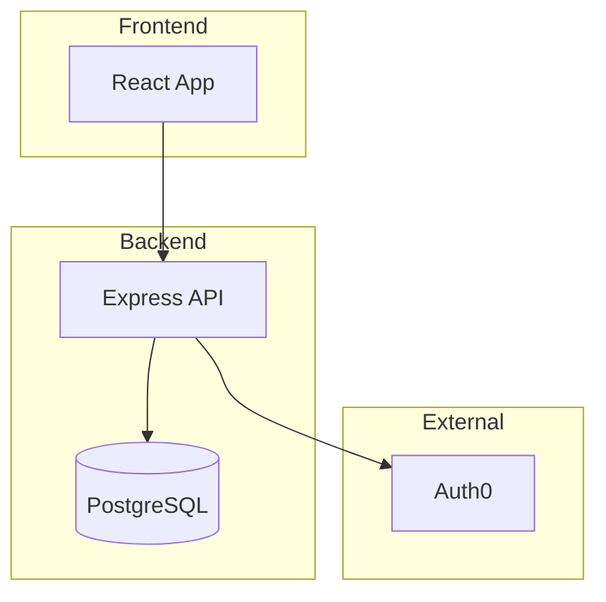

# Claude Code Prompt: GitHub Repo → Instant Spec Analyzer

## Project Context

I'm building a feature for SDLC.dev (an AI-powered SDLC automation platform) that analyzes any public GitHub repository and generates a comprehensive project specification. This is designed to be a viral, traffic-driving feature with zero friction (no signup required for public repos).

## Feature Requirements

### Core User Flow

```
1. User visits sdlc.dev/analyze (or homepage with prominent CTA)
2. User pastes a GitHub repo URL (e.g., github.com/user/repo)
3. Click "Generate Spec" button
4. Show loading state with progress indicators
5. Display beautiful, comprehensive spec output
6. User can copy, share, or download the spec
```

### Input Handling

Accept these URL formats:
- `https://github.com/owner/repo`
- `https://github.com/owner/repo.git`
- `github.com/owner/repo`
- `owner/repo` (shorthand)

Validate that:
- Repository exists and is public
- Repository is not empty
- Repository size is reasonable (warn if > 100MB, limit analysis)

### GitHub Data to Fetch

Use GitHub API (unauthenticated for public repos, rate limit: 60 req/hour per IP):

```typescript
// Priority 1: Essential
- GET /repos/{owner}/{repo} → repo metadata
- GET /repos/{owner}/{repo}/readme → README content
- GET /repos/{owner}/{repo}/contents → root directory listing
- GET /repos/{owner}/{repo}/languages → language breakdown

// Priority 2: Structure Analysis
- GET /repos/{owner}/{repo}/contents/{path} → key files:
  - package.json, requirements.txt, Cargo.toml, go.mod (dependencies)
  - docker-compose.yml, Dockerfile (infrastructure)
  - .env.example (configuration)
  - src/ or lib/ structure (architecture)

// Priority 3: Additional Context
- GET /repos/{owner}/{repo}/topics → tags/topics
- GET /repos/{owner}/{repo}/contributors → top contributors (limit 5)
- GET /repos/{owner}/{repo}/releases/latest → latest release info
```

### Output Specification Structure

Generate a spec with these sections:

```markdown
# {Repo Name} - Project Specification

> Auto-generated by SDLC.dev | Generated on {date}
> Source: {github_url}

## 1. Project Overview
- **Purpose**: What this project does (1-2 sentences)
- **Type**: Library / CLI Tool / Web App / API / Framework / etc.
- **Status**: Active / Maintained / Archived (from repo metadata)
- **License**: {license}

## 2. Tech Stack
| Layer | Technology |
|-------|------------|
| Language | {primary_language} |
| Framework | {detected_framework} |
| Database | {if_detected} |
| Infrastructure | {docker/k8s/serverless} |

## 3. Architecture Overview

{mermaid_diagram}

### Key Components
- **{component_1}**: Description
- **{component_2}**: Description

### Directory Structure
{simplified_tree_structure}

## 4. Core Features
- Feature 1 (inferred from code/readme)
- Feature 2
- Feature 3

## 5. API Reference (if applicable)
| Endpoint | Method | Description |
|----------|--------|-------------|
| /api/... | GET | ... |

## 6. Data Models (if detected)
{entity_relationship_or_schema}

## 7. Getting Started
### Prerequisites
- {requirement_1}
- {requirement_2}

### Installation
{detected_or_generated_install_steps}

### Configuration
{env_variables_and_config}

## 8. Documentation Gaps
⚠️ Suggested improvements:
- [ ] {missing_doc_1}
- [ ] {missing_doc_2}

## 9. Project Metrics
- ⭐ {stars} stars | 🍴 {forks} forks
- 📅 Last updated: {last_push}
- 👥 {contributors_count} contributors

---
Generated by [SDLC.dev](https://sdlc.dev) | [Analyze your repo](https://sdlc.dev/analyze)
```

### Mermaid Diagram Generation

Generate architecture diagrams based on detected patterns:



Detection rules:
- Next.js/Nuxt → SSR architecture
- Express/Fastify + React → Client-Server
- Monorepo → Show packages relationship
- Microservices (docker-compose with multiple services) → Service mesh diagram

## Technical Implementation

### Tech Stack for This Feature

```
Frontend:
- React/Next.js (assuming existing stack)
- Tailwind CSS for styling
- Framer Motion for loading animations
- react-syntax-highlighter for code blocks
- mermaid.js for diagram rendering

Backend:
- Next.js API routes OR Express endpoints
- GitHub API (octokit)
- Claude API for analysis
- Redis for caching (optional but recommended)

Database:
- Store generated specs for sharing (PostgreSQL/Supabase)
```

### API Endpoint Design

```typescript
// POST /api/analyze
// Request
{
  "repoUrl": "https://github.com/owner/repo",
  "options": {
    "includeApiDocs": true,
    "includeArchitectureDiagram": true,
    "analysisDepth": "standard" | "deep"
  }
}

// Response
{
  "success": true,
  "specId": "abc123", // for sharing
  "spec": {
    "markdown": "...",
    "sections": {...},
    "metadata": {
      "generatedAt": "ISO timestamp",
      "repoInfo": {...},
      "analysisVersion": "1.0"
    }
  },
  "shareUrl": "https://sdlc.dev/spec/abc123"
}

// GET /api/spec/:id
// Returns cached/stored spec for sharing
```

### Claude API Prompt for Analysis

```typescript
const analysisPrompt = `You are an expert software architect analyzing a GitHub repository to generate a comprehensive project specification.

## Repository Information
- Name: ${repoName}
- Description: ${repoDescription}
- Primary Language: ${primaryLanguage}
- Languages: ${JSON.stringify(languages)}
- Topics: ${topics.join(', ')}

## README Content
${readmeContent}

## Directory Structure
${directoryTree}

## Key Files Content
### package.json / requirements.txt / etc.
${dependencyFileContent}

### Configuration Files
${configFilesContent}

## Your Task
Generate a comprehensive project specification following this exact structure:

1. **Project Overview**: Concise description of what this project does and its purpose
2. **Tech Stack**: Identify ALL technologies used (frameworks, libraries, databases, tools)
3. **Architecture**:
   - Generate a Mermaid diagram showing the system architecture
   - Identify and describe key components
   - Show how components interact
4. **Core Features**: List main features (infer from code structure and README)
5. **API Reference**: If this is an API/backend, document endpoints found
6. **Data Models**: If database schemas or models are detected, document them
7. **Getting Started**: Generate setup instructions (improve upon README if sparse)
8. **Documentation Gaps**: Identify what's missing that a good project should have

## Output Format
Return valid markdown with proper formatting. For the architecture diagram, use Mermaid syntax wrapped in \`\`\`mermaid code blocks.

## Important Guidelines
- Be specific, not generic. Reference actual file names and components found.
- If you can't determine something with confidence, say "Could not be determined from repository analysis"
- The Mermaid diagram should reflect the ACTUAL architecture, not a generic template
- Focus on what makes this project unique
- Keep the spec actionable and useful for developers joining the project`;
```

### Caching Strategy

```typescript
// Cache layers:
// 1. In-memory cache (5 minutes) - for rapid re-requests
// 2. Redis/KV cache (1 hour) - for sharing links
// 3. Database (permanent) - for saved specs with shareId

const cacheKey = `spec:${owner}:${repo}:${commitSha}`;

// Invalidation: Cache by commit SHA so updates trigger re-analysis
```

### Database Schema

```sql
CREATE TABLE generated_specs (
  id UUID PRIMARY KEY DEFAULT gen_random_uuid(),
  share_id VARCHAR(12) UNIQUE NOT NULL, -- short shareable ID
  repo_owner VARCHAR(255) NOT NULL,
  repo_name VARCHAR(255) NOT NULL,
  repo_url TEXT NOT NULL,
  commit_sha VARCHAR(40),
  spec_markdown TEXT NOT NULL,
  spec_json JSONB,
  metadata JSONB, -- stars, forks, languages at generation time
  created_at TIMESTAMP DEFAULT NOW(),
  view_count INTEGER DEFAULT 0,

  -- Indexes
  INDEX idx_repo (repo_owner, repo_name),
  INDEX idx_share_id (share_id)
);
```

## Frontend Components

### Main Analyzer Page (`/analyze`)

```tsx
// Key components needed:
// 1. RepoUrlInput - URL input with validation
// 2. AnalyzeButton - With loading state
// 3. ProgressIndicator - Shows analysis steps
// 4. SpecViewer - Renders the generated spec
// 5. SharePanel - Copy link, download, badges
// 6. MermaidRenderer - Renders architecture diagrams

// State management:
// - analysisStatus: 'idle' | 'fetching' | 'analyzing' | 'complete' | 'error'
// - progress: { step: string, percent: number }
// - spec: GeneratedSpec | null
// - error: string | null
```

### Loading State UX

Show progress steps:
```
✓ Fetching repository metadata
✓ Analyzing directory structure
⟳ Reading key configuration files
○ Analyzing architecture patterns
○ Generating specification
```

### Share/Export Options

```tsx
<SharePanel>
  <CopyButton text={spec.markdown} label="Copy Markdown" />
  <CopyButton text={shareUrl} label="Copy Share Link" />
  <DownloadButton format="md" />
  <DownloadButton format="pdf" />
  <BadgeGenerator repoUrl={repoUrl} specUrl={shareUrl} />
</SharePanel>
```

### README Badge Generator

```markdown
<!-- Badge options -->
[](https://sdlc.dev/spec/{shareId})

<!-- Or dynamic -->
[](https://sdlc.dev/analyze?repo=owner/repo)
```

## Error Handling

```typescript
const errorMessages = {
  REPO_NOT_FOUND: "Repository not found. Make sure it exists and is public.",
  REPO_EMPTY: "This repository appears to be empty.",
  RATE_LIMITED: "GitHub API rate limit reached. Try again in a few minutes or sign in for higher limits.",
  REPO_TOO_LARGE: "This repository is too large for free analysis. Sign up for Pro to analyze large repos.",
  ANALYSIS_FAILED: "Analysis failed. This might be an unusual project structure.",
  PRIVATE_REPO: "This appears to be a private repository. Sign in to analyze private repos."
};
```

## Rate Limiting & Abuse Prevention

```typescript
// Without auth: 3 analyses per hour per IP
// With free account: 10 analyses per hour
// With Pro: 100 analyses per hour

// Implement with:
// - IP-based rate limiting (middleware)
// - Captcha after 2 requests without account
// - Block known bot user agents
```

## SEO & Open Graph

```tsx
// Dynamic OG image for shared specs
// /api/og/[shareId] → generates preview image

<meta property="og:title" content="{repoName} - Project Specification" />
<meta property="og:description" content="Auto-generated spec: {shortDescription}" />
<meta property="og:image" content="https://sdlc.dev/api/og/{shareId}" />
<meta property="og:url" content="https://sdlc.dev/spec/{shareId}" />
```

## File Structure

```
/app
├── analyze/
│   └── page.tsx                 # Main analyzer page
├── spec/
│   └── [shareId]/
│       └── page.tsx             # Shared spec viewer
├── api/
│   ├── analyze/
│   │   └── route.ts             # POST - analyze repo
│   ├── spec/
│   │   └── [shareId]/
│   │       └── route.ts         # GET - fetch spec
│   ├── badge/
│   │   └── route.ts             # GET - SVG badge
│   └── og/
│       └── [shareId]/
│           └── route.ts         # GET - OG image
├── components/
│   ├── analyzer/
│   │   ├── RepoUrlInput.tsx
│   │   ├── AnalyzeButton.tsx
│   │   ├── ProgressIndicator.tsx
│   │   └── SpecViewer.tsx
│   ├── spec/
│   │   ├── SpecSection.tsx
│   │   ├── MermaidDiagram.tsx
│   │   ├── TechStackTable.tsx
│   │   └── SharePanel.tsx
│   └── common/
│       ├── CopyButton.tsx
│       └── DownloadButton.tsx
├── lib/
│   ├── github-analyzer.ts       # GitHub API client
│   ├── repo-analyzer.ts         # Analysis orchestration
│   ├── spec-generator.ts        # Claude API integration
│   └── spec-cache.ts            # Caching logic
└── types/
    └── analyzer.ts              # TypeScript types
```

## Implementation Phases

### Phase 1: MVP (This Sprint)
1. Basic URL input + validation
2. GitHub API data fetching
3. Claude analysis prompt
4. Simple spec output (markdown rendered)
5. Copy markdown button

### Phase 2: Sharing & Polish
1. Database storage for specs
2. Share URLs (`/spec/{shareId}`)
3. Better UI/loading states
4. Mermaid diagram rendering
5. Download as MD/PDF

### Phase 3: Growth Features
1. OG images for social sharing
2. README badges
3. Rate limiting + accounts
4. Analytics (track popular repos analyzed)
5. "Analyze Private Repo" with GitHub OAuth

## Environment Variables Needed

```env
# GitHub (optional - for higher rate limits)
GITHUB_TOKEN=ghp_xxx

# Claude API
ANTHROPIC_API_KEY=sk-ant-xxx

# Database
DATABASE_URL=postgresql://...

# Redis (optional)
REDIS_URL=redis://...

# App
NEXT_PUBLIC_APP_URL=https://sdlc.dev
```

## Testing Checklist

Test with diverse repos:
- [ ] Small utility library (< 10 files)
- [ ] Large monorepo (turborepo/nx style)
- [ ] Python ML project
- [ ] Rust CLI tool
- [ ] React component library
- [ ] Full-stack Next.js app
- [ ] Go microservice
- [ ] Empty repo (should error gracefully)
- [ ] Repo with no README
- [ ] Very large repo (> 1000 files)

## Success Metrics

Track these:
- Specs generated per day
- Share link clicks
- Conversion to signup
- Most analyzed repos
- Error rates by repo type

---

## Commands to Start

```bash
# After reviewing this spec, start with:

1. Set up the API route for /api/analyze
2. Implement GitHub data fetching in /lib/github-analyzer.ts
3. Create the Claude analysis prompt in /lib/spec-generator.ts
4. Build the basic UI in /app/analyze/page.tsx
5. Test with 3-4 different repos
6. Add sharing functionality
7. Polish UI and add loading states
```

Now implement this feature following the structure above. Start with Phase 1 MVP, get it working end-to-end, then iterate.
