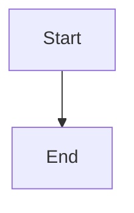
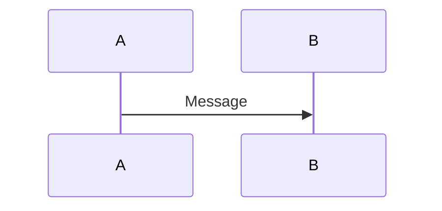

# Mermaid Diagram Generation Improvements

## Issue
When generating multiple Mermaid diagrams, they're sometimes concatenated without proper markdown code blocks, causing parsing errors.

## Solution Implemented

### 1. Enhanced Parsing
The parser now handles both scenarios:
- **With markdown blocks**: Parses standard ```mermaid code blocks
- **Without markdown blocks**: Detects diagram boundaries by looking for diagram type declarations

### 2. Automatic Syntax Fixing
- Fixes quoted subgraph names: `subgraph "Name"` → `subgraph Name`
- Handles spaces in subgraph names: `subgraph Security & Compliance` → `subgraph subgraph1[Security & Compliance]`
- Balances brackets and quotes
- Adds missing `end` statements for subgraphs
- Fixes classDef and class syntax

### 3. Prompt Improvement Suggestion

To ensure diagrams are properly generated with markdown blocks, update your Mermaid prompts to include:

```
Generate Mermaid diagrams for [topic]. 

IMPORTANT: 
1. Each diagram MUST be wrapped in markdown code blocks with ```mermaid
2. Separate each diagram with a heading and description
3. Use valid Mermaid syntax without quotes in subgraph names
4. Example format:

## Diagram 1: System Overview
Description of what this diagram shows.



## Diagram 2: Sequence Flow
Description of the sequence.


```

### 4. Database Prompt Template

Consider adding a Mermaid-specific prompt template in your database:

```sql
INSERT INTO prompt_templates (name, description, prompt_template, variables, is_active, category)
VALUES (
  'mermaid_architecture_fixed',
  'Generate properly formatted Mermaid architecture diagrams',
  'Generate comprehensive Mermaid architecture diagrams for: {{input}}

Requirements:
1. Create 3-5 different diagrams showing different aspects
2. Each diagram MUST be in a ```mermaid code block
3. Include clear headings before each diagram
4. Do NOT use quotes in subgraph names
5. For subgraphs with spaces, use format: subgraph id[Label with Spaces]
6. Ensure all subgraphs have matching end statements

Generate diagrams for:
- System Architecture Overview
- Data Flow
- Deployment Architecture
- Security Architecture
- API/Service Communication',
  '["input"]',
  true,
  'technical'
);
```

This will help ensure consistent, properly formatted diagram generation.