# Technical Architecture - SDLC AI Platform

## 🏗️ System Overview

SDLC AI is built as a modern, scalable web application using Next.js 15 with a microservices-oriented architecture. The system leverages AI models for document generation, Supabase for data persistence, and various third-party integrations for workflow automation.

## 📐 High-Level Architecture

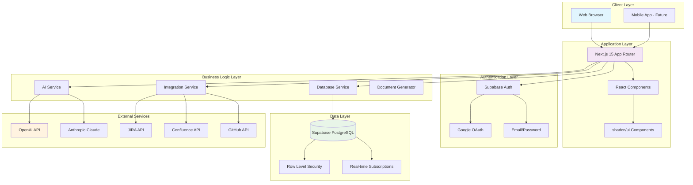

## 🔧 Component Architecture

### Frontend Architecture

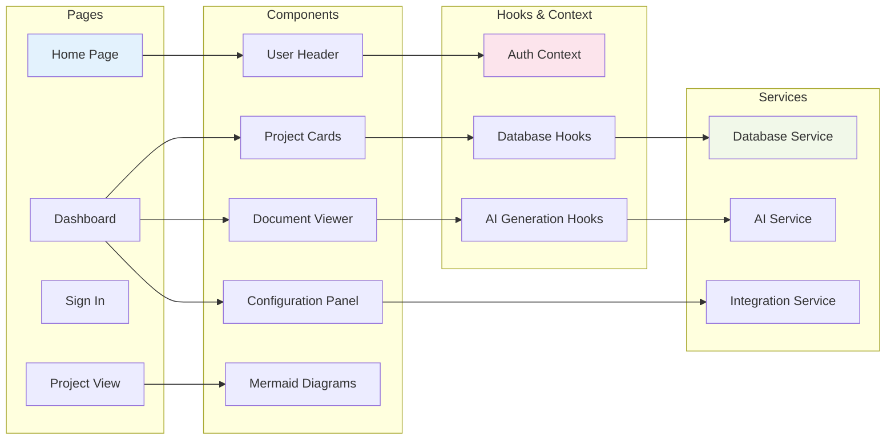

## 🗄️ Database Schema

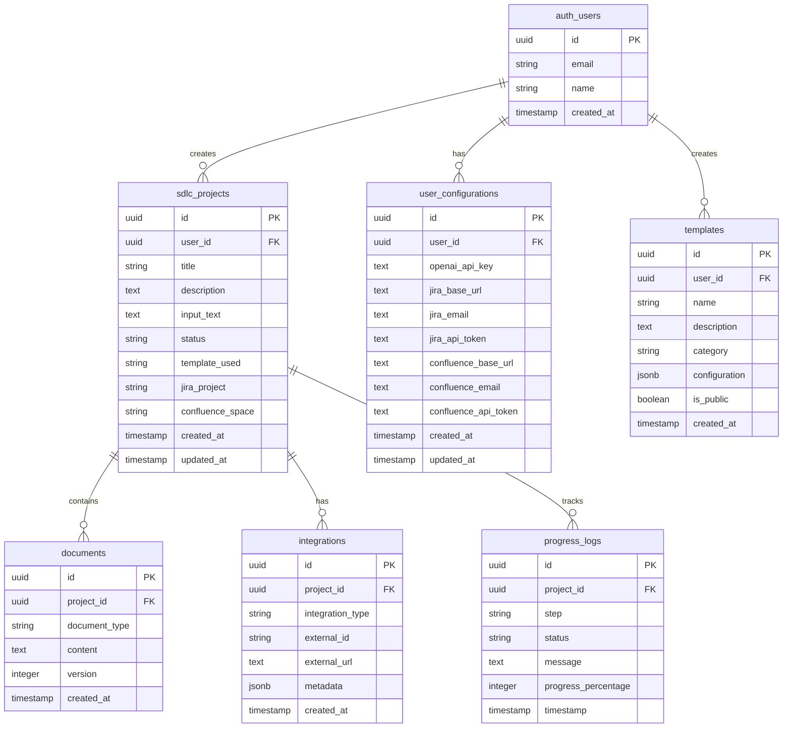

## 🔄 Data Flow Architecture

### Document Generation Flow

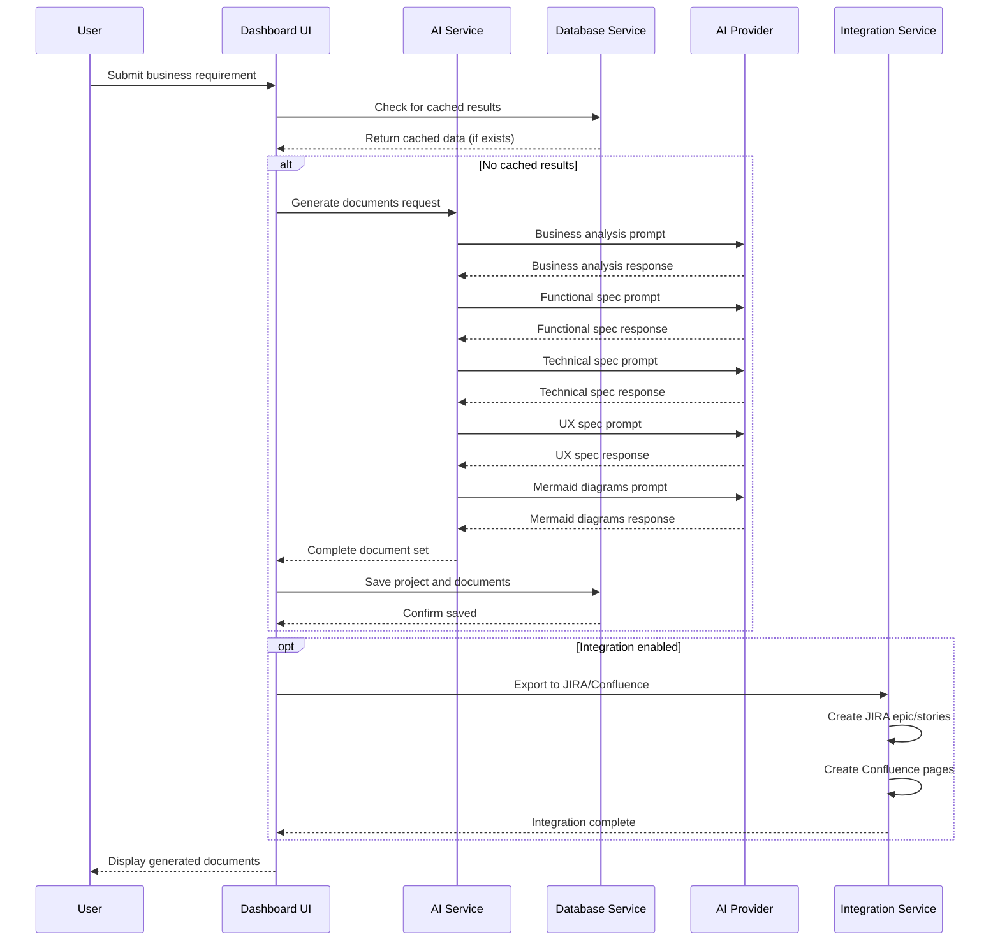

### Authentication Flow

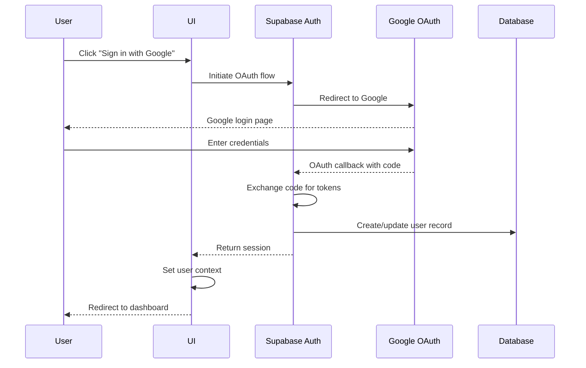

## 🔌 Integration Architecture

### Third-Party Service Integration

```mermaid
graph TB
    subgraph "SDLC AI Platform"
        A[Integration Service]
        B[Configuration Manager]
        C[API Client Factory]
    end
    
    subgraph "Atlassian Suite"
        D[JIRA API]
        E[Confluence API]
    end
    
    subgraph "Development Tools"
        F[GitHub API]
        G[GitLab API]
        H[Azure DevOps API]
    end
    
    subgraph "Communication"
        I[Slack API]
        J[Microsoft Teams API]
        K[Email Service]
    end
    
    A --> B
    B --> C
    C --> D
    C --> E
    C --> F
    C --> G
    C --> H
    C --> I
    C --> J
    C --> K
    
    style A fill:#e8f5e8
    style D fill:#0052cc
    style F fill:#24292e
    style I fill:#4a154b
```

## 🚀 Deployment Architecture

### Production Deployment

```mermaid
graph TB
    subgraph "CDN Layer"
        A[Vercel Edge Network]
        B[Static Assets]
        C[Edge Functions]
    end
    
    subgraph "Application Layer"
        D[Next.js Application]
        E[API Routes]
        F[Server Components]
    end
    
    subgraph "Database Layer"
        G[Supabase PostgreSQL]
        H[Connection Pooling]
        I[Read Replicas]
    end
    
    subgraph "External Services"
        J[OpenAI API]
        K[Anthropic API]
        L[Third-party APIs]
    end
    
    subgraph "Monitoring"
        M[Vercel Analytics]
        N[Supabase Monitoring]
        O[Error Tracking]
    end
    
    A --> D
    B --> A
    C --> E
    D --> F
    E --> G
    G --> H
    G --> I
    E --> J
    E --> K
    E --> L
    
    D --> M
    G --> N
    D --> O
    
    style A fill:#000000
    style G fill:#3ecf8e
    style J fill:#74aa9c
```

## 🔒 Security Architecture

### Security Layers

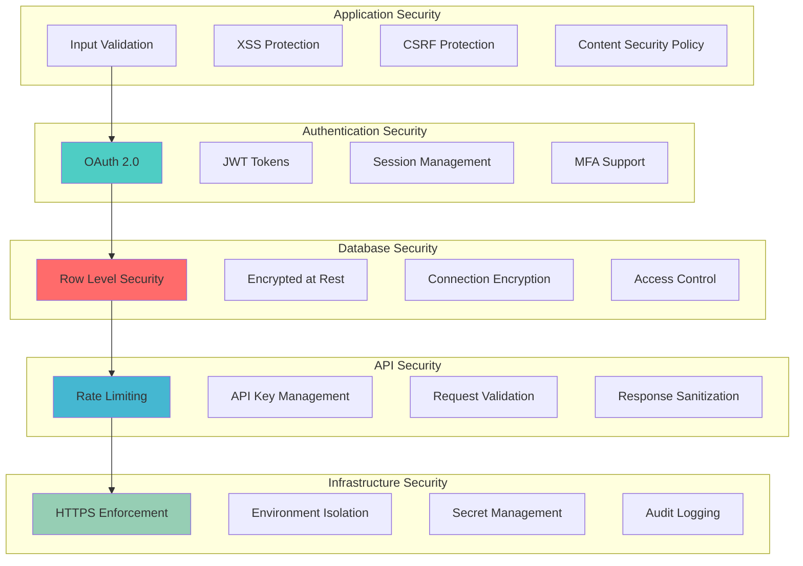

## 📊 Performance Architecture

### Optimization Strategies

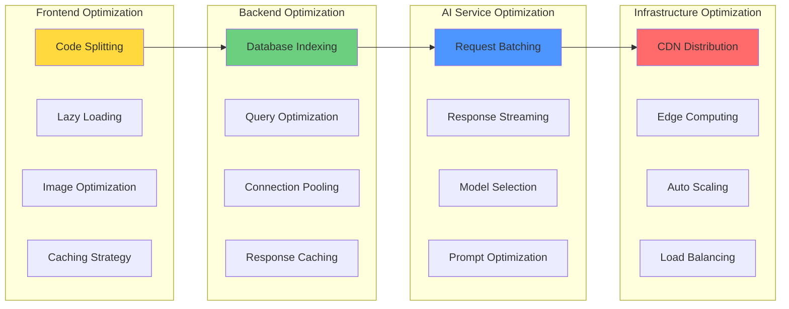

## 🔧 Development Architecture

### Development Workflow

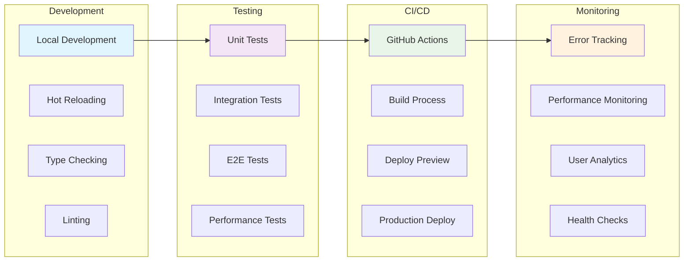

## 📱 Responsive Design Architecture

### Multi-Device Support

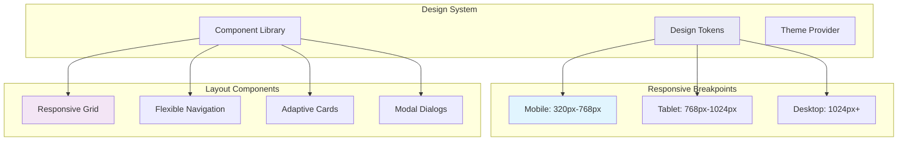

## 🔄 State Management Architecture

### Application State Flow

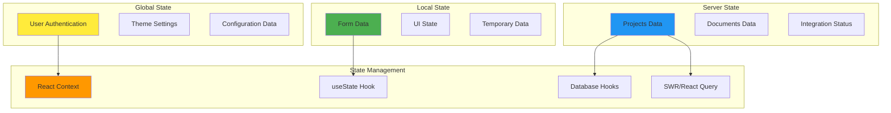

## 🎯 Scalability Considerations

### Horizontal Scaling Strategy

- **Database**: Supabase handles automatic scaling and read replicas
- **Application**: Vercel serverless functions scale automatically
- **AI Services**: Rate limiting and request queuing for API calls
- **Caching**: Multi-layer caching strategy (browser, CDN, database)
- **Monitoring**: Real-time performance monitoring and alerting

### Performance Metrics

- **Page Load Time**: < 2 seconds for initial load
- **Document Generation**: < 30 seconds for complete SDLC docs
- **Database Queries**: < 100ms for most operations
- **API Response Time**: < 500ms for standard requests
- **Uptime**: 99.9% availability target

## 🔮 Future Architecture Enhancements

### Planned Improvements

1. **Microservices Migration**: Break down monolith into focused services
2. **Real-time Collaboration**: WebSocket integration for live editing
3. **Advanced Caching**: Redis integration for improved performance
4. **Multi-tenant Architecture**: Support for enterprise customers
5. **Event-Driven Architecture**: Implement event sourcing for audit trails
6. **Container Orchestration**: Docker and Kubernetes for deployment
7. **API Gateway**: Centralized API management and security
8. **Message Queues**: Async processing for long-running operations

---

This architecture supports the current needs while providing flexibility for future growth and feature additions. 