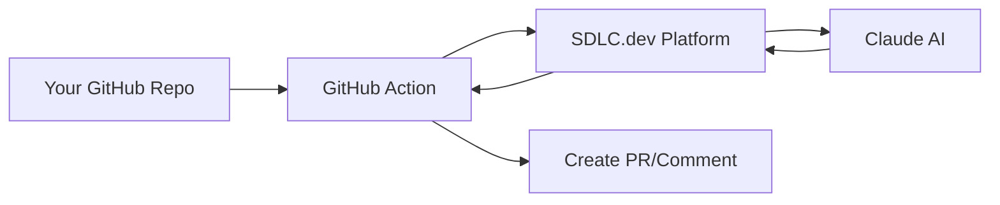

# 🚀 Install Claude AI Assistant in Your GitHub Repository

This guide shows you how to install the SDLC.dev Claude AI Assistant in your GitHub repositories.

## 📋 Prerequisites

1. **SDLC.dev Account**: You need an active account on the SDLC.dev platform
2. **GitHub Repository**: Admin access to the repository where you want to install Claude
3. **Claude API Key**: Configured in your SDLC.dev Integration Hub
4. **Platform Token**: Your SDLC.dev user authentication token

## 🔧 Installation Steps

### Step 1: Get Your Platform Token

1. Go to your **SDLC.dev Dashboard**
2. Navigate to **Settings** → **API Tokens**
3. Click **Generate New Token**
4. Copy the token (you'll need it in Step 3)

### Step 2: Download the GitHub Workflow

1. **Option A: Download from Platform**
   - Go to **Integration Hub** → **GitHub** → **Download Workflow**
   - Save as `.github/workflows/claude-assistant.yml` in your repo

2. **Option B: Manual Installation**
   ```bash
   # Create the workflow directory
   mkdir -p .github/workflows
   
   # Download the workflow file
   curl -o .github/workflows/claude-assistant.yml \
     https://sdlc.dev/api/github/workflow-template
   ```

### Step 3: Configure Repository Secrets

In your GitHub repository:

1. Go to **Settings** → **Secrets and variables** → **Actions**
2. Click **New repository secret**
3. Add these secrets:

   ```
   SDLC_USER_TOKEN
   Value: [Your token from Step 1]
   
   SDLC_PLATFORM_URL (optional)
   Value: https://sdlc.dev
   ```

### Step 4: Test the Installation

1. Create a new issue in your repository
2. Add a comment: `/claude help me improve this function`
3. The Claude assistant should respond within 1-2 minutes

## 🎯 Usage Examples

### Issue Comments
```bash
# Bug fixes
/claude fix the authentication bug in login.js

# Code improvements  
/claude refactor the user service to use async/await

# Feature development
/claude add a dark mode toggle to the header component

# Code review
/claude review this file for security issues
```

### Pull Request Reviews
Claude automatically reviews all new pull requests and provides:
- Code quality feedback
- Security vulnerability detection
- Performance optimization suggestions
- Best practice recommendations

## 🔍 How It Works



1. **Trigger**: You comment `/claude <task>` or create a PR
2. **GitHub Action**: Runs in your repository
3. **Platform Call**: Action calls SDLC.dev with your task
4. **AI Processing**: Platform orchestrates Claude AI analysis
5. **Response**: Results posted back to your repository

## ⚙️ Configuration Options

### Workflow Customization

Edit `.github/workflows/claude-assistant.yml` to customize:

```yaml
# Change trigger conditions
on:
  issue_comment:
    types: [created]
  pull_request:
    types: [opened, synchronize]
  # Add schedule for periodic reviews
  schedule:
    - cron: '0 9 * * MON'  # Monday morning reviews

# Customize timeout
jobs:
  claude-assist:
    timeout-minutes: 10  # Default: 5 minutes
```

### Platform Settings

In your **SDLC.dev Integration Hub**:

- **Claude Model**: Choose between Sonnet, Haiku, or Opus
- **GitHub Access**: Configure repository permissions
- **Auto-PR Creation**: Enable/disable automatic pull requests
- **Review Depth**: Set code review thoroughness level

## 🛡️ Security & Privacy

### Data Handling
- **Your Code**: Temporarily analyzed by Claude for the specific task
- **API Keys**: Stored securely in SDLC.dev's encrypted database
- **Results**: Only stored in your GitHub repository
- **No Persistence**: Platform doesn't retain your code after processing

### Permissions
The GitHub Action requires these permissions:
- **Contents**: Read repository files, create PRs
- **Issues**: Post comments and updates
- **Pull Requests**: Create reviews and comments

### Token Security
- **Platform Token**: Used to authenticate with SDLC.dev API
- **Scope Limited**: Only accesses your configured integrations
- **Revocable**: Can be revoked anytime from your dashboard

## 🐛 Troubleshooting

### Common Issues

**❌ "SDLC_USER_TOKEN secret not configured"**
- Solution: Add your platform token to repository secrets

**❌ "Claude API key not configured"**
- Solution: Configure Claude API key in SDLC.dev Integration Hub

**❌ "Task timed out after 5 minutes"**
- Solution: Try a simpler task or check platform status

**❌ "Platform API call failed"**
- Solution: Verify your platform token is valid and not expired

### Getting Help

1. **Platform Status**: Check [status.sdlc.dev](https://status.sdlc.dev)
2. **Documentation**: Visit [docs.sdlc.dev](https://docs.sdlc.dev)
3. **Support**: Email support@sdlc.dev
4. **Community**: Join our Discord for community help

## 🔄 Updates & Maintenance

### Workflow Updates
- **Automatic**: Minor updates applied automatically
- **Major Changes**: You'll be notified to update manually
- **Version Pinning**: Pin to specific versions in workflow file

### Token Rotation
- **Monthly**: Recommended to rotate platform tokens
- **Automated**: Set up automated token rotation (enterprise)
- **Notifications**: Platform emails you before token expiry

## 🚀 Advanced Features

### Multiple Repositories
Install the same workflow across multiple repositories:

```bash
# Bulk installation script
for repo in repo1 repo2 repo3; do
  gh secret set SDLC_USER_TOKEN --body "$SDLC_TOKEN" --repo "yourusername/$repo"
done
```

### Custom Triggers
Add custom webhook triggers:

```yaml
# Trigger on specific labels
on:
  issues:
    types: [labeled]
    # Only run when "ai-review" label is added
```

### Integration with Other Actions
Combine with other GitHub Actions:

```yaml
- name: Run tests first
  run: npm test
  
- name: Claude review if tests pass
  if: success()
  uses: # ... claude action
```

## 📊 Analytics & Monitoring

Track your Claude AI usage in the **SDLC.dev Dashboard**:

- **Task History**: View all completed tasks
- **Performance Metrics**: Response times and success rates  
- **Cost Tracking**: Monitor Claude API usage
- **Repository Insights**: See which repos use Claude most

---

**Need Help?** Contact our support team at support@sdlc.dev or visit our [documentation](https://docs.sdlc.dev). 